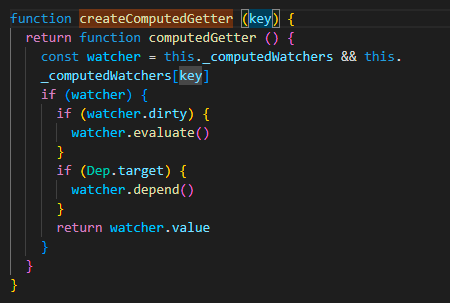
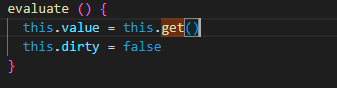

## 几个词语
ECMA、POSIX、StackBlitz、chromium

## vue中computed的原理
以vue2源码为例，当我们在data中赋值的时候，会进行数据劫持和数据代理，其中数据代理，是把数据代理到vue实例属性上。

我们假设，computed定义成函数的形式，执行initComputed方法
  
将会创建一个watcher，并调用defineComputed方法
 

这里将会将数据代理中的get改写成createComputedGetter方法
  

执行watcher.evaluate  
  
也就是调用watcher中的get方法，执行getter，这个getter就是传入的computed方法

当我们更新一个值的时候，由于页面会重新编译，当编译成ast，再次执行到计算属性时，会调用计算属性的代理，再次执行watcher.evaluate。所以我们会获取新的计算属性的值到页面上。

## commonjs和es module的区别
[点击查看](_posts\2022-06-14-Commonjs和ES Module.md)

## vite为什么这么快

## Event Loop

## nodejs

## babel编译原理

## 你的优点和缺点