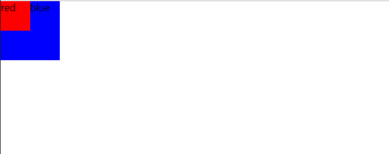

### @media媒体查询与默认样式
有时候会发现@media中的样式没有执行，例如，下面这段就没有执行@media中的样式
```css
@media screen and (max-width:1000px) {
  .chart{
    width:500px;
    height:300px;
  }
}

.chart{
  width:1000px;
  height: 600px;
  border:solid 1px red;
}
```
这是因为后面的样式会覆盖前面的样式，所以顺序不能错误（默认样式要放在@media媒体查询的前面）
```css
.chart{
  width:1000px;
  height: 600px;
  border:solid 1px red;
}

@media screen and (max-width:1000px) {
  .chart{
    width:500px;
    height:300px;
  }
}
```
修改之后，可以正常的实现@media中的样式，实现了响应式布局

### flex布局
flex包含三个属性 flex-grow flex-shrink flex-basis  
flex-grow 当前元素是否可以拉伸  
flex-shrink 当前元素是否可以压缩  
flex-basis 当前元素的宽度 (可以忽略元素width的设置) 
flex:1 对应 flex-grow:1;(可以拉伸)flex-shrink:1;(可以压缩)flex-basis:0%;(填充宽度)  
flex:auto 对应 flex-grow:1;(可以拉伸)flex-shrink:1;(可以压缩)flex-basis:auto;(根据内容计算宽度)  
flex:默认值 对应 flex-grow:0;(不可以拉伸)flex-shrink:1;(可以压缩)flex-basis:auto;(根据内容计算宽度)  

### width、max-width与min-width同时存在
width 与 max-width 同时设置时，取的是两者中最小的值  
width 与 min-width 同时设置时，取的是两者中最大的值  
min-width 与 max-width 同时设置时，取的是 min-width  
#### 当三者同时设置时：
1. 计算min-width与width中的最大值， 若两者中最大值为min-width 则取的是 min-width; 若最大值为width 则再进行第2步比较
2. 计算width与max-width中的最大值， 取的是两者中最大的值。伪伪代码如下 Math.max(minWidth, width) == minWidth ? minWidth: Math.min(width, maxWdith)


### 自定义checkbox样式
例如：input label有下面两种写法
```html
<input type="checkbox" id="awesome" />
<label for="awesome">Awesome!</label>
<!-- 或者直接 -->
<label>
  <input type="checkbox" />
  <span>Awesome!</span>
</label>
```
针对第一种
```css
input[type="checkbox"] + label::before {
    content: "\a0";  /*不换行空格*/
    display: inline-block;
    vertical-align: .2em;
    width: .8em;
    height: .8em;
    margin-right: .2em;
    border-radius: .2em;
    background-color: silver;
    text-indent: .15em;
    line-height: .65;  /*行高不加单位，子元素将继承数字乘以自身字体尺寸而非父元素行高*/
}

input[type="checkbox"]:checked + label::before {
    content: "\2713";
    background-color: yellowgreen;
}

input {
    position: absolute;
    clip: rect(0, 0, 0, 0);
}
```


参考：
🥇 [自定义input[type="checkbox"]的样式](https://www.cnblogs.com/xinjie-just/p/7302020.html)

#### 高度height的百分比为什么不生效  
[css进阶之十：高度height的百分比为何不生效](https://zhyjor.github.io/2018/06/15/css%E8%BF%9B%E9%98%B6%E4%B9%8B%E5%8D%81%EF%BC%9A%E9%AB%98%E5%BA%A6height%E7%9A%84%E7%99%BE%E5%88%86%E6%AF%94%E4%B8%BA%E4%BD%95%E4%B8%8D%E7%94%9F%E6%95%88/)

### :nth-child(n)、:first-child、:last-child等区别 
```css
:nth-child(n) 根据元素在一组同级中的位置匹配元素
:first-child 表示在一组兄弟元素中的第一个元素
:last-child 表示一组兄弟元素中的最后一个元素
```

### IFC
指行内格式化上下文（Inline formatting context）：
* 行内上下文内部的盒子会在水平方向，一个接一个的放置
* 当一行不够的时候会自动切换到下一行
* 行内上下文的高度由行内部最高的内联盒子的高度觉得
### 盒模型和BFC

#### 盒模型
所有HTML元素可以看作盒子，在CSS中，"box model"这一术语是用来设计和布局时使用。CSS盒模型本质上是一个盒子，封装周围的HTML元素，它包括：边距，边框，填充，和实际内容。盒模型允许我们在其它元素和周围元素边框之间的空间放置元素。

盒模型可以分为：  
* 标准盒模型：  
  
* IE盒模型：  
  

块级盒子：  
* 盒子会在内联的方向上扩展并占据父容器在该方向上的所有可用空间，在绝大数情况下意味着盒子会和父容器一样宽
* 每个盒子都会换行
* width和height属性可以发挥作用
* 内边距（padding）, 外边距（margin）和 边框（border）会将其他元素从当前盒子周围“推开”

inline盒子：
* 盒子不会换行
* width 和 height 属性将不起作用
* 垂直方向的内边距、外边距以及边框会被应用但是不会把其他处于 inline 状态的盒子推开
* 水平方向的内边距、外边距以及边框会被应用且会把其他处于 inline 状态的盒子推开

#### BFC
块格式化上下文（Block Formatting Context，BFC） 是 Web 页面的可视 CSS 渲染的一部分，是块级盒子的布局过程发生的区域，也是浮动元素与其他元素交互的区域。  

BFC的特性：
* 内部的盒子会在垂直方向上一个接一个的放置
* 对于同一个BFC的俩个相邻的盒子的margin会发生重叠，与方向无关。
* 每个元素的左外边距与包含块的左边界相接触（从左到右），即使浮动元素也是如此
* BFC的区域不会与float的元素区域重叠
* 计算BFC的高度时，浮动子元素也参与计算
* BFC就是页面上的一个隔离的独立容器，容器里面的子元素不会影响到外面的元素，反之亦然

下面的方式可以触发BFC：
* 根元素（<html>）
* 浮动元素（float 值不为 none）
* 绝对定位元素（position 值为 absolute 或 fixed）
* 行内块元素（display 值为 inline-block）
* 表格单元格（display 值为 table-cell，HTML 表格单元格默认值）
* 表格标题（display 值为 table-caption，HTML 表格标题默认值）
* 匿名表格单元格元素（display 值为 table、table-row、 table-row-group、table-header-group、 table-footer-group（分别是 HTML table、tr、tbody、thead、tfoot 的默认值）或 inline-table）
* overflow 值不为 visible、clip 的块元素
* display 值为 flow-root 的元素
* contain 值为 layout、content 或 paint 的元素
* 弹性元素（display 值为 flex 或 inline-flex 元素的直接子元素），如果它们本身既不是 flex、grid 也不是 table 容器
* 网格元素（display 值为 grid 或 inline-grid 元素的直接子元素），如果它们本身既不是 flex、grid 也不是 table 容器
* 多列容器（column-count 或 column-width (en-US) 值不为 auto，包括column-count 为 1）
* column-span 值为 all 的元素始终会创建一个新的 BFC，即使该元素没有包裹在一个多列容器中 (规范变更, Chrome bug)

格式化上下文影响布局，通常，我们会为定位和清除浮动创建新的 BFC，而不是更改布局，因为它将：
* 包含内部浮动
* 排除外部浮动
* 阻止 外边距重叠


### float遮挡、margin塌陷与margin合并
要解决这些问题，我们引入BFC来解决
#### 问题1： float遮挡
```html
<style type="text/css">
  * {
    margin: 0;
    padding: 0;
  }

  .left {
    width: 50px;
    height: 50px;
    background: red;
    float: left;
  }

  .right {
    width: 100px;
    height: 100px;
    background: blue;
  }
</style>

<body>
  <div class="left">red</div>
  <div class="right">blue</div>
</body>
```
出现下面的情况：
  
可以看到由于left div脱离了文档流，导致遮挡了blue div
解决方法：  
**由于html标签会触发BFC，所以在整个页面中的所有元素都默认处于同一个BFC之中**，red div设置了float:left;使其变成了一个BFC容器，但是，整体上来看，它还是与blue div处于同一个BFC（html）中。我们使用float，或者overflow等设置blue div
```html
<style type="text/css">
  * {
    margin: 0;
    padding: 0;
  }

  .left {
    width: 50px;
    height: 50px;
    background: red;
    float: left;
  }

  .right {
    width: 100px;
    height: 100px;
    background: blue;
    overflow: hidden;
  }
</style>
<body>
  <div class="left">red</div>
  <div class="right">blue</div>
</body>
```  


#### 问题2： margin塌陷
```html
<style type="text/css">
  * {
    margin: 0;
    padding: 0;
  }

  .father {
    width: 200px;
    height: 200px;
    background-color: rgb(219, 68, 101);
    margin-left: 100px;
    margin-top: 100px;
  }

  .son {
    width: 100px;
    height: 100px;
    background-color: rgb(56, 248, 207);
    margin-left: 50px;
    margin-top: 50px;
  }
</style>
<body>
  <div class="father">
    <div class="son"></div>
  </div>
</body>
```
出现下面的情况：  

可以看到子元素垂直方向没有变化。这是因为默认盒模型中：父子嵌套的元素方向的margin取最大值  

解决方法：通过给father元素添加overflow:hidden;触发它的BFC，改变默认盒模型的渲染方式
```html
<style type="text/css">
  * {
    margin: 0;
    padding: 0;
  }

  .father {
    width: 200px;
    height: 200px;
    background-color: rgb(219, 68, 101);
    margin-left: 100px;
    margin-top: 100px;
    overflow: hidden;
  }

  .son {
    width: 100px;
    height: 100px;
    background-color: rgb(56, 248, 207);
    margin-left: 50px;
    margin-top: 50px;
  }
</style>
<body>
  <div class="father">
    <div class="son"></div>
  </div>
</body>
```  


#### 问题3： margin合并
```html
<style type="text/css">
  * {
    margin: 0;
    padding: 0;
  }

  .one {
    background-color: pink;
    width: 400px;
    height: 200px;
    margin-bottom: 100px;
  }

  .two {
    background-color: purple;
    width: 500px;
    height: 100px;
    margin-top: 100px;
  }
</style>
<body>
  <div class="one"></div>
  <div class="two"></div>
</body>
```
出现下面的情况：  

可以看到one和two元素margin之间不是200px，而是100px，这就叫margin合并，盒模型默认取最大margin值合并  

解决方法：  
```html
<style type="text/css">
  * {
    margin: 0;
    padding: 0;
  }

  .wrap {
    overflow: hidden;
  }

  .one {
    background-color: pink;
    width: 400px;
    height: 200px;
    margin-bottom: 100px;
  }

  .two {
    background-color: purple;
    width: 500px;
    height: 100px;
    margin-top: 100px;
  }
</style>

<body>
  <div class="one"></div>
  <div class="wrap">
    <div class="two"></div>
  </div>
</body>
```  


参见:   
[理解margin塌陷和margin合并及其解决方案](https://juejin.cn/post/6976272394247897101)

### 元素水平垂直居中
* 行内元素居中布局
  * 水平居中
    * 行内元素可设置：text-align: center
    * flex布局设置父元素：display: flex; justify-content: center
  * 垂直居中
    * 单行文本父元素确认高度：height === line-height
    * 多行文本父元素确认高度：display: table-cell; vertical-align: middle
* 块级元素居中布局
  * 水平居中
    * 定宽: margin: 0 auto
    * 绝对定位+left:50%+margin:负自身一半
  * 垂直居中
    * position: absolute设置left、top、margin-left、margin-top(定高)
    * display: table-cell
    * transform: translate(x, y)
    * flex(不定高，不定宽)
    * grid(不定高，不定宽)，兼容性相对比较差


### css中双冒号和单冒号的区别
CSS3中单冒号用于**伪类**，双冒号用于**伪元素**

### 打包优化
压缩文件
减少回流操作，以及减少不必要的重绘

