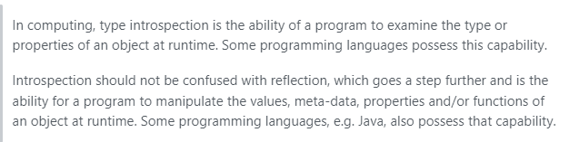
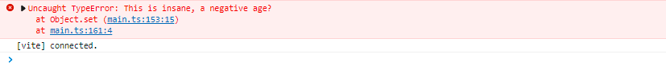

## 元编程
> Metaprogramming is a programming technique in which computer programs have the ability to treat other programs as their data. It means that a program can be designed to read, generate, analyze or transform other programs, and even modify itself while running.

## Reflect
一个内置的对象，它提供拦截 JavaScript 操作的方法。这些方法与proxy handlers的方法相同。Reflect不是一个函数对象，因此它是不可构造的。

### 反射:Reflect 属于元编程的范畴
Reflection的三个特点：
1. Introspection (内省：说白了，可以获取代码中我需要的信息,Object.keys、Object.getPrototypeOf、Reflect.ownKeys等等都是内省的) 
2. Self-Modification (自修改)
3. Intercession (代理)


参见：
* [What is the difference between introspection and reflection?](https://stackoverflow.com/questions/25198271/what-is-the-difference-between-introspection-and-reflection)
* [编程语言的自省与反射](https://cifer76.github.io/posts/introspection-reflection/?msclkid=9d2d78f6cdb411ec8b7e8d74c1959bbd)

### 为什么Reflect APIs
Reflect的所有api都是内省的，但是js中已经存在内省工具：Object.keys, Object.getOwnPropertyNames等等。所以为什么还需要Reflect?
1. All in One Namespace: JavaScript 已经支持用于对象反射的 API，但是这些 API 并未组织在命名空间下。 从 ES6 开始，这些都在 Reflect 下
2. Simplicity in use: Object上的内省方法在错误会抛出异常，如果程序没有进行处理则会报错，执行不下去。而Reflect会返回true或false
   ```ts
   try {
        Object.defineProperty(obj, name, desc);
        // property defined successfully
   } catch (e) {
        // possible failure and need to do something about it
   }


   if (Reflect.defineProperty(obj, name, desc)) {
        // success
   } else {
        // failure (and far better)
   }
   ```
3. Feeling of First-Class Operations
4. Reliability in function apply: ES5中调用一个函数可以使用```func.apply(obj, arr)```，这样并不可靠。因为obj对象可能有自己定义的func方法。ES6中更可靠和优雅的方式：```Reflect.apply(func, obj, arr)```
5. Proxy Trap Forwarding: 与Proxy配合使用

## Proxy 
对象用于创建一个对象的代理，从而实现基本操作的拦截和自定义（如属性查找、赋值、枚举、函数调用等）  
Proxy是我们在JavaScript中进行元编程的几种方法中重要的一种，它可以定义基本操作的自定义行为（例如属性查找、赋值、枚举、函数调用等）
```ts
type Employee = {
  firstName: string
  lastName: string
  [x: string]: string
} & {
  age?: number
}

const employee: Employee = {
  firstName: 'Tapas',
  lastName: 'Adhikary',
}

console.group('employee');
    console.log(employee.firstName);
    console.log(employee.lastName);
    console.log(employee.org);
    console.log(employee.fullName);
console.groupEnd()
```
输出结果：
```css
employee
  Tapas
  Adhikary
  undefined
  undefined
```
使用Proxy进行代理
```ts
const handler: ProxyHandler<Employee> = {
  get(target, p: string) {
    if (p === 'fullName') {
      return `${target.firstName} ${target.lastName}`
    }
    return p in target ? target[p] : `No such property as, '${p}'`
  },
}
const p = new Proxy(employee, handler)
console.log('\n')
console.group('employee')
console.log(p.firstName)
console.log(p.lastName)
console.log(p.org)
console.log(p.fullName)
console.groupEnd()
```
输出结果：
```css
proxy
  Tapas
  Adhikary
  No such property as, 'org'!
  Tapas Adhikary
```

使用Proxy进行值的校验
```ts
const validator: ProxyHandler<Employee> = {
  set(target, p, value) {
    if (p === 'age') {
      if (!Number.isInteger(value)) {
        throw new TypeError('Age is always an Integer, Please Correct it!')
      }
      if (value < 0) {
        throw new TypeError('This is insane, a negative age?')
      }
    }
    return true
  },
}

const p2 = new Proxy(employee, validator)
p2.age = -10
```



注意：  
**Proxy 中接受的 Receiver 形参表示代理对象本身或者继承与代理对象的对象**  
**Reflect 中传递的 Receiver 实参表示修改执行原始操作时的 this 指向**


参见：  
1. [Metaprogramming: An Introduction to JavaScript(ES6) Proxy](https://blog.greenroots.info/metaprogramming-an-introduction-to-javascriptes6-proxy)
2. [JavaScript: Why Reflect APIs?](https://blog.greenroots.info/javascript-why-reflect-apis)
3. [为什么Proxy一定要配合Reflect使用？](https://juejin.cn/post/7080916820353351688)
4. [元编程](https://developer.mozilla.org/zh-CN/docs/Web/JavaScript/Guide/Meta_programming)