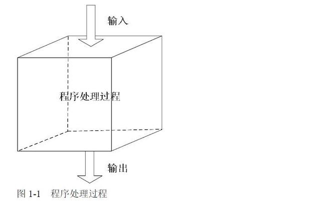

## 常见概念

1. 单元测试  
   单元测试是对应用程序最小的部分（单元）运行测试的过程。通常，测试的单元是函数，但在前端应用中，组件也是被测单元  
   单元测试可以单独调用源代码中的函数并断言其行为是否正确
   
   * 优点
     * 提升代码质量，减少 Bug
     * 快速反馈，减少调试时间
     * 让代码维护更容易
     * 有助于代码的模块化设计
     * 代码覆盖率高
   * 缺点
     * 由于单元测试是独立的，所以无法保证多个单元运行到一起是否正确
2. 集成测试  
   人们定义集成测试的方式并不相同，尤其是对于前端。有些人认为在浏览器环境上运行的测试是集成测试；有些人认为对具有模块依赖性的单元进行的任何测试都是集成测试；也有些人认为任何完全渲染的组件测试都是集成测试
   * 优点
     * 由于是从用户使用角度出发，更容易获得软件使用过程中的正确性
     * 集成测试相对于写了软件的说明文档
     * 由于不关注底层代码实现细节，所以更有利于快速重构
     * 相比单元测试，集成测试的开发速度要更快一些
   * 缺点
     * 测试失败的时候无法快速定位问题
     * 代码覆盖率较低
     * 速度比单元测试要慢
3. 端到端测试(e2e)  
   在前端应用程序中，端到端测试可以从用户的视角通过浏览器自动检查应用程序是否正常工作
   
   * 优点
     * 真实的测试环境，更容易获得程序的信心
   * 缺点
     * 首先，端到端测试运行不够快
     * 端到端测试的另一个问题是调试起来比较困难
   流行的端到端测试框架：[Cypress](https://github.com/cypress-io/cypress)、
4. 快照测试  
   快照测试类似于“找不同”游戏。快照测试会给运行中的应用程序拍一张图片，并将其与以前保存的图片进行比较。如果图像不同，则测试失败。这种测试方法对确保应用程序代码变更后是否仍然可以正确渲染很有帮助
5. 回归测试   
   回归测试是指修改了旧代码后，重新进行测试以确认修改没有引入新的错误或导致其他代码产生错误。自动回归测试将大幅降低系统测试、维护升级等阶段的成本。回归测试作为软件生命周期的一个组成部分，在整个软件测试过程中占有很大的工作量比重，软件开发的各个阶段都会进行多次回归测试
6. **```测试覆盖率```**  
   测试覆盖率(test coverage)是衡量软件测试完整性的一个重要指标。掌握测试覆盖率数据，有利于客观认识软件质量，正确了解测试状态，有效改进测试工作
   * 代码覆盖率  
     被执行测试的代码数量与代码总数量之间的比值，就是代码覆盖率。适用于白盒测试，尤其是单元测试。
   * 需求覆盖率  
     测试所覆盖的需求数量与总需求数量的比值。适用于黑盒测试
7. TDD
   (Test-driven development)，测试驱动开发，测试驱动开发，是敏捷开发中的一项核心实践和技术，也是一种软件设计方法论
8. BDD
   (Behavior-driven development)，行为驱动开发，是测试驱动开发延伸出来的一种敏捷软件开发技术

## other
从被测试对象的角度分类，测试方法可以分为黑盒测试、白盒测试、灰盒测试三种  
任何一个程序在测试时都由这几部分组成：输入、程序的处理过程和输出三部分

* 黑盒测试：是指在整个测试过程中只关注输入和输出，如果输入一个测试数据，输出的结果是正确的，我们就认为这个功能是正确的
* 白盒测试：白盒测试不仅仅关注输入与输出的结果是否正确，同时还关注程序是如何处理的，同样是上面的例子，输入测试数据(2,2)，白盒测试不仅仅关注测试结果是否为4，同时还关注这个程序的内部逻辑处理过程
* 灰盒测试：灰盒测试是界于黑盒测试和白盒测试之间的一种测试。之所以存在灰盒测试，是因为按测试阶段来划分，整个测试的流程包括单元测试、集成测试、系统测试，而白盒测试对应单元测试，黑盒测试对应系统测试，那么在正确的测试过程中，应该是先测试单元模块，单元模块测试完成之后，并没有立即进入系统测试，而是集成测试，这个时候其使用的方法就是灰盒测试，即我们测试完成单个模块后，虽然单个模块没有问题，但并不代表这些模块组合在一块时就一定没有问题。那么要验证这些功能模块组合在一起有没有问题，这就是我们说的集成测试，其使用方法就是灰盒测试


附录：
1. [前端测试](https://www.yuque.com/lipengzhou/frontend-testing/gg965i)
2. [软件测试｜黑盒、白盒、灰盒测试的区别](https://zhuanlan.zhihu.com/p/55616948)