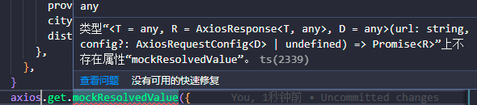

## 基础
1. Jest提供```transform```配置，通过转译器来对```testEnvironment```(位于jest配置文件中)，不支持的语法（比如JSX,ts,vue模板语法）来进行转译。Jest内置```babel-jest```。 它会加载你项目的 Babel 配置，然后转译所有能正确匹配 /\.[jt]sx?$/ 正则表达式的文件。此外，babel-jest还将会注入 ES Module mocking中所提到的Babel插件  

2. ```babel-jest```默认会转义typescript文件，但不会校验ts的类型。如果你想校验类型，请将转译器改成```ts-jest```
   
   参见：[代码转换](https://jestjs.io/zh-Hans/docs/code-transformation)

3. 配置VS Code调试Jest  
   参见：[Debugging in VS Code](https://jestjs.io/docs/troubleshooting#debugging-in-vs-code)

4. jest单元测试覆盖率
   
   * %stmts是语句覆盖率（statement coverage）：是不是每个语句都执行了？
   * %Branch分支覆盖率（branch coverage）：是不是每个if代码块都执行了？
   * %Funcs函数覆盖率（function coverage）：是不是每个函数都调用了？
   * %Lines行覆盖率（line coverage）：是不是每一行都执行了？

## 测试异步代码
  * callback回调函数形式
    ```ts
    test('async test', done => {
      getData(data => {
        done()
        expect(data).toEqual({ foo: 'bar' })
      })
    })

    function getData(callback: (arg: { foo: string }) => void) {
      setTimeout(() => {
        callback({ foo: 'bar' })
      }, 2000)
    }
    ```
  * promise形式一
    ```ts
    test('async test', () => {
      return getData().then(data => {
        expect(data).toEqual({ foo: 'bar' })
      })
    })
    function getData() {
      return new Promise((resolve, reject) => {
        setTimeout(() => {
          resolve({ foo: 'bar' })
        }, 2000)
      })
    }
    ```
  * promise形式二（resolves,rejects）
    ```ts
    test('async test', () => {
      return expect(getData()).resolves.toEqual({ foo: 'bar' })
    })
    function getData() {
      return new Promise((resolve, reject) => {
        setTimeout(() => {
          resolve({ foo: 'bar' })
        }, 2000)
      })
    }
    ```
  * promise形式三（async/await）
    ```ts
    test('async test', async () => {
      const data = await getData()
      expect(data).toEqual({ foo: 'bar' })
    })
    function getData() {
      return new Promise((resolve, reject) => {
        setTimeout(() => {
          resolve({ foo: 'bar' })
        }, 2000)
      })
    }
    ```

## expected to throw error
在项目中我们定义如下函数：
```ts
function calculateSquare(num) {
  if (num === undefined || typeof num !== ‘number’) {
    throw new Error(‘You must provide a number.’);
  }
  return num * num;
}
```
我们使用jest进行测试：
```ts
test('should throw an error if called without an arg', () => {
  expect(calculateSquare()).toThrow('You must provide a number');
})
test('should throw an error if called without a number', () => {
  expect(calculateSquare('45')).toThrow('You must provide a   number');
})
```
会发现并不想我们预期的那样执行代码，而是会报错  
根据 [https://jestjs.io/docs/expect#tothrowerror](https://jestjs.io/docs/expect#tothrowerror) 的说明，我们需要对函数进行包装
```ts
test('should throw an error if called without an arg', () => {
  expect(() => {
    calculateSquare());
  }).toThrow('You must provide a number');
})
```
一句话进行解释：测试预期异常的时候，不要在expect中调用

参见：[How to test a function that’s expected to throw error in jest…](https://medium.com/@afolabiwaheed/how-to-test-a-function-thats-expected-to-throw-error-in-jest-2419cc7c6462)


## setUp and tearDown
* setUp()函数是在众多函数或者说是在一个类类里面最先被调用的函数，而且每执行完一个函数都要从setUp()调用开始后再执行下一个函数，有几个函数就调用他几次，与位置无关，随便放在那里都是他先被调用。
* tearDown(）函数是在众多函数执行完后他才被执行，意思就是不管这个类里面有多少函数，他总是最后一个被执行的，与位置无关，放在那里都行，最后不管测试函数是否执行成功都执行tearDown()方法；如果setUp()方法失败，则认为这个测试项目失败，不会执行测试函数也不执行tearDown()方法。  
  
参见：[setUp()和tearDown()函数](https://www.cnblogs.com/insane-Mr-Li/p/9085062.html)


jest会在所有beforeEach、beforeAll、afterEach、afterAll、test语句之前，首先执行describe中的handlers

```ts
describe('pollingAction', () => {
  console.log('describe block outer 1')
  beforeEach(() => {
    console.log('pollingAction 01 -- beforeEach')
  })

  beforeEach(() => {
    console.log('pollingAction 02 -- beforeEach')
  })

  afterEach(() => {
    console.log('pollingAction 01 -- afterEach')

  })

  afterEach(() => {
    console.log('pollingAction 02 -- afterEach')
  })

  describe('describe test', () => {
    console.log('describe inner 01')
    describe('', () => {
      console.log('describe inner 01 - 02')
      describe('', () => {
        console.log('describe inner 01 - 02 - 03')
      })
    })
  })   

  test('测试非立即执行轮询', () => {
    console.log('test 测试非立即执行轮询 ')
  })

  test('测试立即执行轮询', () => {
    console.log('test 测试立即执行轮询 ')

  })

  beforeAll(() => {
    console.log('pollingAction 01 -- beforeAll')
  })
  beforeAll(() => {
    console.log('pollingAction 02 -- beforeAll')
  })
  afterAll(() => {
    console.log('pollingAction 01 -- afterAll')
  })
  afterAll(() => {
    console.log('pollingAction 02 -- afterAll')
  })

  describe('', () => {
    console.log('describe block outer 2')
  })
})
```
执行结果如下：
```css
  console.log
    describe block outer 1

      at src/__test__/testSubject.spec.ts:5:11

  console.log
    describe inner 01

      at src/__test__/testSubject.spec.ts:24:13

  console.log
    describe inner 01 - 02

      at src/__test__/testSubject.spec.ts:26:15

  console.log
    describe inner 01 - 02 - 03

      at src/__test__/testSubject.spec.ts:28:17

  console.log
    describe block outer 2

      at src/__test__/testSubject.spec.ts:56:13

  console.log
    pollingAction 01 -- beforeAll

      at src/__test__/testSubject.spec.ts:43:13

  console.log
    pollingAction 02 -- beforeAll

      at src/__test__/testSubject.spec.ts:46:13

  console.log
    pollingAction 01 -- beforeEach

      at Object.<anonymous> (src/__test__/testSubject.spec.ts:7:13)

  console.log
    pollingAction 02 -- beforeEach

      at Object.<anonymous> (src/__test__/testSubject.spec.ts:11:13)

  console.log
    test 测试非立即执行轮询

      at Object.<anonymous> (src/__test__/testSubject.spec.ts:34:13)

  console.log
    pollingAction 01 -- afterEach

      at Object.<anonymous> (src/__test__/testSubject.spec.ts:15:13)

  console.log
    pollingAction 02 -- afterEach

      at Object.<anonymous> (src/__test__/testSubject.spec.ts:20:13)

  console.log
    pollingAction 01 -- beforeEach

      at Object.<anonymous> (src/__test__/testSubject.spec.ts:7:13)

  console.log
    pollingAction 02 -- beforeEach

      at Object.<anonymous> (src/__test__/testSubject.spec.ts:11:13)

  console.log
    test 测试立即执行轮询

      at Object.<anonymous> (src/__test__/testSubject.spec.ts:38:13)

  console.log
    pollingAction 01 -- afterEach

      at Object.<anonymous> (src/__test__/testSubject.spec.ts:15:13)

  console.log
    pollingAction 02 -- afterEach

      at Object.<anonymous> (src/__test__/testSubject.spec.ts:20:13)

  console.log
    pollingAction 01 -- afterAll

      at src/__test__/testSubject.spec.ts:49:13

  console.log
    pollingAction 02 -- afterAll

      at src/__test__/testSubject.spec.ts:52:13
```


## Mock Timer


## Mock函数
为什么我们需要mock函数？  
考虑几种情况：
1. 当我们定义一个没有返回值的方法，如下所示,
   ```ts
    function hello(){
      console.log('hello')
    }
   ```
   如何进行测试呢？可能我们会觉得，直接执行hello函数
   ```ts
    test('test hello',()=>{
      hello()
    })
   ```
     
   没有报错，且显示```PASS```，表示测试通过了。  
   但的确是这样吗？如果我说，```PASS```只是说明测试通过了，但是根本就没有调用hello函数。你该怎么证明我说错了呢？你可能会说你看终端已经打印'hello'，说明的确是调用了啊。那如果hello函数中没有```console.log```呢？终端没有打印信息，你怎么证明我说错了？
2. 我们如何测试axios请求呢？你可能会说，直接axios.get或者axios.post这个接口，只要返回数据匹配上，就表明测试通过。但是如果在项目前期，后端还没有写这个接口，怎么通过axios请求？或者这个接口需要查询大量的数据，很耗时。
3. 假设一段代码中使用了定时器，设置延时5分钟，那我们代码在测试的时候，也是这样一直等5分钟吗？  
......

综合上面的描述：我们可以看到在真实的项目中，我们的代码经常要做各种导致我们测试很难进行的事情。Ajax请求，timer，日期，跨浏览器特性…或者如果你使用Nodejs，则面对数据库，网络，文件操作等  

所有这些事情之所以不容易测试是因为你无法轻易用代码控制它们

单元测试必须将关注点放在要被测试的 Function 身上，不能让不确定性在 Function 外的地方发生，因此要使用 Mock 回避掉不确定性，让焦点集中在受测试的 Function 上。所以引入了mock，(类似还有[sinonjs](https://sinonjs.org/))，让我们可以控制函数的方方面面。通过mock操作，我们可以获取mock函数的信息，实现：
* **捕获对函数的调用（以及在这些调用中传递的参数和调用时的 this 指向）**
* **自由的设置函数返回接口**
* **改变内部函数的实现**

jest对象上有fn,mock,spyOn三个方法，在实际项目的单元测试中，jest.fn()常被用来进行某些有回调函数的测试；jest.mock()可以mock整个模块中的方法，当某个模块已经被单元测试100%覆盖时，使用jest.mock()去mock该模块，节约测试时间和测试的冗余度是十分必要；当需要测试某些必须被完整执行的方法时，常常需要使用jest.spyOn()

* ```jest.fn()```  
  常用在进行某些回调函数的测试  
  Jest.fn()所创建的Mock函数还可以设置返回值，定义内部实现或返回Promise对象
* ```jest.mock()```  
  常用于mock整个第三方模块
* ```jest.spyOn()```  
  本质上，jest.spyOn()是jest.fn()的语法糖。当我们在方法A中使用了别的模块（自己写的）中的方法B。这种情况下常使用spyOn，因为这样做我们可以实际调用方法B。这样的话，在整个开发周期中，当我们修改方法B的时候，方法A中就可以实时获取最新的方法B。

备注：jest.fn()和jest.spyOn()最大的区别，spyOn可以restore original function，fn则不可以。因为spyOn用在已存在的方法上，所以可以。而fn是创建新的方法，所以无法谈起restore

## Jest使用遇到的问题
1. 当在项目中使用```lodash-es```，报错：```"SyntaxError: Unexpected token export"```  
  参见：https://stackoverflow.com/questions/42260218/jest-setup-syntaxerror-unexpected-token-export   
  将lodash安装在devDependencies。```npm i -D lodash```  
  将jest.config.ts配置文件```moduleNameMapper```改成下面即可  
  （亲测只有这一种方式有效）
    ```ts
    moduleNameMapper: {
      '^lodash-es$': 'lodash',    
    },
    ```

2. 当在jest中使用mock axios时，
   ```ts
    import axios from 'axios'
    jest.mock(axios)

    test('test mock axios',()=>{
      axios.get.mockResolvedValue({}) // 报错信息如下
    })
   ```
   
   ```ts
    import axios from 'axios'
    jest.mock('axios')
    const mockedAxios = axios as jest.Mocked<typeof axios>

    // 正常执行
    test('test mock axios', () => {
      mockedAxios.get.mockResolvedValue({})
      return mockedAxios
      .get(
        'https://apis.map.qq.com/ws/location/v1/ip?key=CDDBZ-FBNH2-XCYUZ-CB74S-PK35F-4ABJK&output=jsonp'
      )
      .then(res => expect(res).toEqual(resp))
    })
   ```
## 附录：
1. [前端测试](https://www.yuque.com/lipengzhou/frontend-testing/gg965i)
2. [Jest | JOJO是你？我的替身能力是 Mock ！](https://medium.com/enjoy-life-enjoy-coding/jest-jojo%E6%98%AF%E4%BD%A0-%E6%88%91%E7%9A%84%E6%9B%BF%E8%BA%AB%E8%83%BD%E5%8A%9B%E6%98%AF-mock-4de73596ea6e)
3. [What is the difference between jest.fn() and jest.spyOn() methods in jest?](https://stackoverflow.com/questions/57643808/what-is-the-difference-between-jest-fn-and-jest-spyon-methods-in-jest)