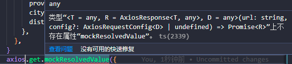
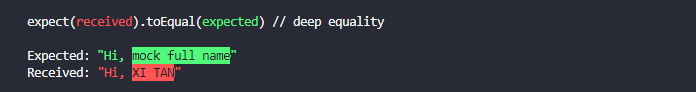
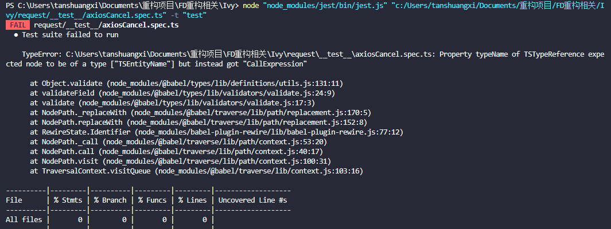

### 1. 当在项目中使用```lodash-es```，报错：```"SyntaxError: Unexpected token export"```  
  参见：https://stackoverflow.com/questions/42260218/jest-setup-syntaxerror-unexpected-token-export   
  将lodash安装在devDependencies。```npm i -D lodash```  
  将jest.config.ts配置文件```moduleNameMapper```改成下面即可  
  （亲测只有这一种方式有效）
    ```ts
    moduleNameMapper: {
      '^lodash-es$': 'lodash',    
    },
    ```
### 2. 当在jest中使用mock axios时
   ```ts
    import axios from 'axios'
    jest.mock(axios)

    test('test mock axios',()=>{
      axios.get.mockResolvedValue({}) // 报如下错误：
    })
   ```
   
  解决方法：
   ```ts
    import axios from 'axios'
    jest.mock('axios')
    const mockedAxios = axios as jest.Mocked<typeof axios>

    // 正常执行
    test('test mock axios', () => {
      mockedAxios.get.mockResolvedValue({})
      return mockedAxios
      .get(
        'https://apis.map.qq.com/ws/location/v1/ip?key=CDDBZ-FBNH2-XCYUZ-CB74S-PK35F-4ABJK&output=jsonp'
      )
      .then(res => expect(res).toEqual(resp))
    })
   ```
   备注：更推荐的方法是直接使用[axios-mock-adapter](https://www.npmjs.com/package/axios-mock-adapter)，功能更加强大

### 3. 当在项目中使用```@babel/plugin-transform-runtime```时，例如.babelrc配置如下
   ```json
    {
      "presets": [
        "@babel/preset-env",
        "@babel/preset-typescript"
      ],
      "plugins": [
        [
          "@babel/plugin-transform-runtime",
          {
            "corejs": {
              "version": "3",
              "proposals": true
            }
          }
        ]
      ]
    }
   ```
  此时当我们在测试setInterval等时，会出现不符合预期的情况，这是因为```@babel/plugin-transform-runtime```会替换全局的setInterval。

  解决方法：  
  使用babel.config.cjs，根据命令行配置babel，来使测试和打包时使用不同的babel配置。例如，babel.config.cjs配置如下：
  ```cjs
  // 使用jest测试时，jest会自动设置环境变量NODE_ENV为“test”
  const config = process.env.NODE_ENV === 'test'
    ? {
        presets: [
          [
            '@babel/preset-env',
            {
              targets: {
                node: 'current',
              },
            },
          ],
          '@babel/preset-typescript',
        ],
      }
    : {
        presets: ['@babel/preset-env', '@babel/preset-typescript'],
        plugins: [
          [
            '@babel/plugin-transform-runtime',
            {
              corejs: {
                version: '3',
                proposals: true,
              },
            },
          ],
        ],
      }

  module.exports = config
  ```  
  参见：[Mocked timers are not used in env with @babel/plugin-transform-runtime](https://github.com/facebook/jest/issues/9649)

### 4. 测试异步代码的时候报如下错误
```css
thrown: "Exceeded timeout of 5000 ms for a test.
Use jest.setTimeout(newTimeout) to increase the timeout value, if this is a long-running test."
```
这是因为jest没有捕获到代码结束  
参见：[官方文档](https://jestjs.io/zh-Hans/docs/asynchronous)

### 5. 测试loadScript方法，一直报错超时
这是因为，这是因为jsdom默认是不加载任何额外的资源的，导致jest无法捕获onload事件
可以在jest.config.ts中添加如下配置，则可以正确执行
```ts
testEnvironmentOptions: { resources: 'usable' },
```
参见：[Image.onload not fired after upgrading for 9.x to 10.x](https://github.com/jsdom/jsdom/issues/1816)

### 6. 当执行new JSDOM时，报错```ReferenceError: TextEncoder is not defined```
解决方法：   
第一步：新建一个setup.js（可以是任意名称），内容如下：
```js
import { TextEncoder, TextDecoder } from 'util'
global.TextEncoder = TextEncoder
global.TextDecoder = TextDecoder
```
第二步：在jest.config.ts中的```setupFilesAfterEnv```属性下引入此js文件  

参见：https://github.com/inrupt/solid-client-authn-js/issues/1676  


### 7. 单元测试中，当某个模块中，导出两个方法，其中一个方法调用了另外一个方法，如下：
```help.ts```
```ts   
export function getFullName(firstName: string, lastName: string) {
  return firstName + ' ' + lastName
}

export function greet(firstName: string, lastName: string) {
  const fullName = getFullName(firstName, lastName)
  return `Hi, ${fullName}`
}
```
```help.spec.ts```
```ts
import { greet } from '../helper'
jest.mock('../helper', () => {
  const originalModule = jest.requireActual('../helper')
  return {
    ...originalModule,
    getFullName: jest.fn().mockReturnValue('mock full name'),
  }
})

describe('', () => {
  test('测试', () => {
    expect(greet('XI', 'TAN')).toEqual('Hi, mock full name')
  })
})
```
报错如下：


或者使用下面的测试方法：  
```help.spec.ts```
```ts
import * as helper from '../helper'
describe('', () => {
  test('测试', () => {
    jest.spyOn(helper, 'getFullName').mockReturnValue('mock full name')
    expect(helper.greet('XI', 'TAN')).toEqual('Hi, mock full name')
  })
})
```
还是报跟上面一样的错误：  


报错原因在于，我们mock的其实只是在*.spec.ts中的引用
推荐两种方法解决：
🎍 第一种: 将help.ts改成导出类
```ts
class Greet {
  getFullName(firstName: string, lastName: string) {
    return firstName + ' ' + lastName
  }

  greet(firstName: string, lastName: string) {
    const fullName = this.getFullName(firstName, lastName)
    return `Hi, ${fullName}`
  }
}
export const g = new Greet()
```
```help.spec.ts```
```ts
import { g } from '../helper'
describe('', () => {
  test('测试', () => {
    jest.spyOn(g, 'getFullName').mockReturnValue('mock full name')
    expect(g.greet('XI', 'TAN')).toEqual('Hi, mock full name')
  })
})
```
✔️ 测试可以通过  

💡 第二种: 采用[babel-rewire-plugin](https://www.npmjs.com/package/babel-plugin-rewire)

此时如果测试代码使用ts写的，则可能会报如下错误：


需要改成babel-plugin-rewire-ts，但是使用的时候又涉及ts类型的问题
所以这里没有使用这种方法

### 8. 测试代码报错“Error: Not implemented: navigation (except hash changes)”
这是因为在代码中使用了```window.location.href```，而在 jsdom 环境中并没有location这个对象，所以就抛出了异常。  
处理方法1：（重新定义window.location属性）
```ts
const mockResponse = jest.fn()
Object.defineProperty(window, 'location', {
  value: {
    replace: mockResponse,
  },
  writable: true,
})
```
参见：https://github.com/chenxiaochun/blog/issues/64

处理方法2：使用 [jest-location-mock](https://www.npmjs.com/package/jest-location-mock)  
在```setupFilesAfterEnv```中引入 jest-location-mock，接着测试代码如下：
```ts
test('测试history模式', () => {
  window.location.assign(
    'http://www.baidu.com?__biz=MzAxODE4MTEzMA==&mid=2650078915&idx=1&sn=4bb48827bb32c7f859141d203fe7a90e&chksm=83da63a6b4adeab096481f1b46de1f45426496d51291598b6ba005b64720029bc52917fba441&scene=21'
  )
  expect(utils.getUrlQuery('history')).toEqual({
    __biz: 'MzAxODE4MTEzMA==',
    mid: '2650078915',
    idx: '1',
    sn: '4bb48827bb32c7f859141d203fe7a90e',
    chksm:
      '83da63a6b4adeab096481f1b46de1f45426496d51291598b6ba005b64720029bc52917fba441',
    scene: '21',
  })
})

test('测试参数为空', () => {
  window.location.assign('http://www.baidu.com')
  expect(utils.getUrlQuery()).toEqual({})
  expect(utils.getUrlQuery('history')).toEqual({})
})
```

✔️ 测试可以通过 

参见：
* [How to mock specific module function in jest?](https://medium.com/@qjli/how-to-mock-specific-module-function-in-jest-715e39a391f4)
* [How to mock functions in the same module using Jest?](https://stackoverflow.com/questions/45111198/how-to-mock-functions-in-the-same-module-using-jest)


### 附录：   
* [使用jest + jsdom测试动态加载js文件的临时解决方法](https://xmanyou.com/jest-jsdom-test-dynamically-loading-js/)  
* [jsdom](https://github.com/jsdom/jsdom#asynchronous-script-loading)
* [setupfilesafterenv和setupfiles区别](https://stackoverflow.com/questions/58080435/when-should-i-use-setupfiles-rather-than-setupfilesafterenv)