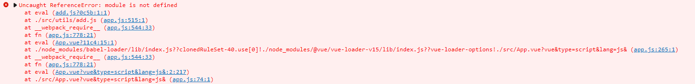
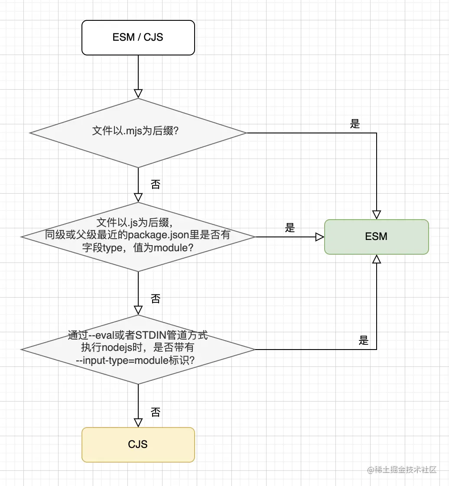

## ESM和CJS模块
早期Javascript这门语言是没有模块化的概念的，直到nodejs诞生，才把模块化引入js。nodejs使用的是CJS（Commonjs）规范，也就是我们平时所见的require、module.exports。而js语言标准的模块规范是ESM（Ecmascript Module），也就是我们在前端工程大量使用的import、export语法。

> nodejs已经在逐步支持ESM，目前很多主流浏览器也已经原生支持ESM。

前端代码分为浏览器端和nodejs端：
* 当为浏览器端时：  
  例如我们在vue项目中写js文件，可以在文件中使用import/export或者module.exports等，这并没有任何问题。但是要有个前提条件：就是我们必须在webpack中通过babel配制好loader进行转换。（同理可以推广到任何浏览器端项目）  

  注意：  
  但当我们在vue项目的package.json中，使用"type":"module"时，则这个时候，项目中的js文件就不能使用module.exports了，否则报错如下所示：
  
* 当为nodejs端时：  
  nodejs按以下流程判断模块系统使用esm还是cjs
    
  不满足以上判断条件的会以CJS兜底。如果你的工程遵循CJS规范，并不需要特殊的文件名后缀和设置package.json type字段等额外的处理。​  
  **_上述表明：.mjs .cjs是运行在nodejs中的，用以判断文件使用的是es模块还是commonjs模块_**

### esm和cjs两者的区别
1. ESM模块里没有__dirname、__filename这些变量  
   但我们可以通过import.meta.url和nodejs的url模块（使用firedirname也可以）来解析出dirname和filename
2. 严格模式vs非严格模式  
   CJS默认是非严格模式，而ESM默认是严格模式
3. 引用vs拷贝  
   CJS模块require导入的是值的拷贝，而ESM导入的是值的引用
4. 静态vs动态  
   JavaScript是一种JIT（just-in-time，即时编译）语言，v8引擎拿到js代码后会边编译边执行，在编译的时候v8就给import导入的模块建立静态的引用，并且在运行时不能更改。所以import都放在文件开头，（不放在开头，编译器也会自动放在开头）不能放在条件语句里。  

   而require导入模块是在运行时才对值进行拷贝，所以require的路径可以使用变量，并且require可以放在代码的任何位置  

   （CJS输出的是一个对象，该对象需要在脚本运行完成后才生成，而ESM的输出是静态的，在编译时就能生成）基于这个差异，ESM比CJS好做tree-shaking
5. 异步vs同步  
   ESM是顶层await的设计，而require是同步加载，所以require无法导入ESM模块，但是可以通过import()导入

参见：
1. [ESM和CJS模块杂谈](https://juejin.cn/post/7048276970768957477)
## Node.js模块中的exports和module.exports的区别
exports只是module.exports的引用，是它的别名，类似于exports=module.exports
```js
var module={
  exports:{
    name:"我是module的exports属性"
  }
}

var export = module.exports; //exports是对module.exports的引用，也就是exports现在指向的内存地址和module.exports指向的内存地址是一样的

console.log(module.exports);    //  { name: '我是module的exports属性' }
console.log(exports);   //  { name: '我是module的exports属性' }

exports.name = "我想改一下名字";

console.log(module.exports);    //  { name: '我想改一下名字' }
console.log(exports);   //  { name: '我想改一下名字' }
//看到没，引用的结果就是a和b都操作同一内存地址下的数据

//这个时候我在某个文件定义了一个想导出的模块
var Circle = {
  name:"我是一个圆",
  func:function(x){
      return x*x*3.14;
  }
};

exports = Circle;  // 看清楚了，Circle这个Object在内存中指向了新的地址，所以exports也指向了这个新的地址，和原来的地址没有半毛钱关系了

console.log(module.exports);    //  { name: '我想改一下名字' }
console.log(exports);   // { name: '我是一个圆', func: [Function] }
```
回到nodejs中，module.exports初始的时候置为{},exports也指向这个空对象
那么，这样写是没问题的：
```js
exports.name = function(x){
    console.log(x);
};
//和下面这个一毛一样，因为都是修改的同一内存地址里的东西
module.exports.name = function(x){
  console.log(x);
};

```
但是这样写就有了区别了：
```js
exports = function(x){
    console.log(x);
};

//上面的 function是一块新的内存地址，导致exports与module.exports不存在任何关系，而require方能看到的只有module.exports这个对象，看不到exports对象，所以这样写是导不出去的

//下面的写法是可以导出去的。说句题外话，module.exports除了导出对象，函数，还可以导出所有的类型，比如字符串、数值等
module.exports = function(x){
  console.log(x);
};
```

参见: [Node.js模块里exports与module.exports的区别?](https://www.zhihu.com/question/26621212)


