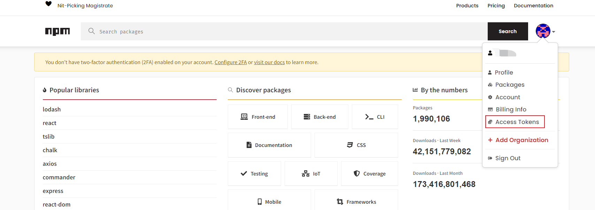
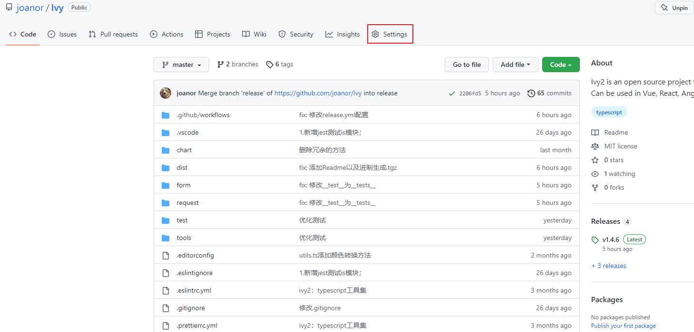
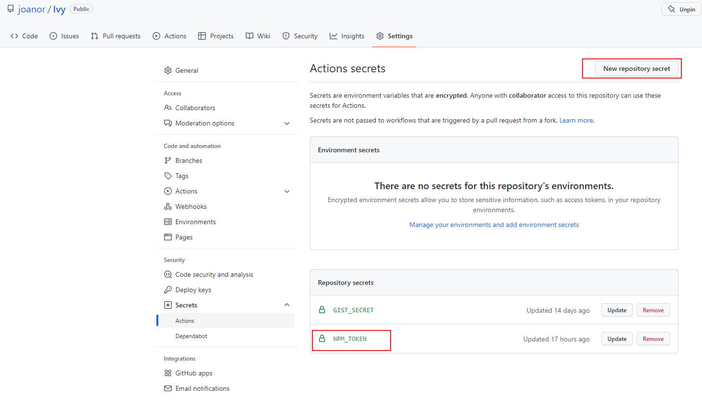
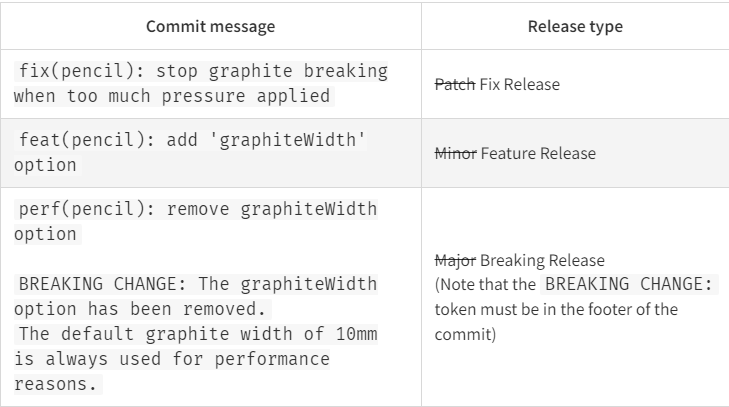

### 想要实现的目标
当我们push完代码之后，github能帮我们自动打包，自动release，自动添加CHANGELOG.md，打上tag，自动发布到npmjs，并且自动增加软件版本号

### 步骤
准备： 
1. 项目中安装 [semantic-release](https://www.npmjs.com/package/semantic-release)  
    ```$ npm i -D semantic-release @semantic-release/changelog @semantic-release/git```
2. 在项目根目录下添加.releaserc配置文件
   ```json
    {
      "branches": "release",
      "plugins": [
        "@semantic-release/commit-analyzer",
        "@semantic-release/release-notes-generator",
        "@semantic-release/changelog",
        [
          "@semantic-release/npm",
          {
            "pkgRoot": "dist" // 表示打包
            // "npmPublish": false  // 表示不要发布到npm
            // "tarballDir": "dist" // 在pkgRoot下生成一个tgz压缩包
          }
        ],
        [
          "@semantic-release/git",
          {
            "assets": [
              "package.json",
              "CHANGELOG.md"
            ],
            "message": "chore(release): ${nextRelease.version} [skip ci]\n\n${nextRelease.notes}"
          }
        ],
        "@semantic-release/github"
      ]
    }
   ```
   可以看到有几个依赖我们没有安装，这是因为在安装semantic-release时，帮我们自动安装了
3. 注册 [npm](https://www.npmjs.com/) 账号，登录之后，点击“Access Tokens”
     
   点击“Generate new Token”，选择Publish类型的token，然后生成Token  
   将生成的Token 复制到github上指定项目仓库中
   
   

开始： 
假定现在仓库中有两个分支：main和release  
其中main分支为开发分支，用于测试代码。release为发布分支  
* 在项目中添加工作流
   ```yml
    # This workflow will run tests using node and then publish a package to GitHub Packages when a release is created
    # For more information see: https://help.github.com/actions/language-and-framework-guides/publishing-nodejs-packages

    name: npm打包发布并自动release

    on: 
      push: 
        branches: 
          - release # 当推送到release分支上时，会执行这个工作流。
                    # 如果git message是fix等开头时，详见下图，才会执行发布操作。

    jobs:
      release:
        name: 打包并发布
        runs-on: ubuntu-latest
        steps:
          - name: 切换到runner上
            uses: actions/checkout@v3
          
          - name: 安装nodejs
            uses: actions/setup-node@v3
            with:
              node-version: 16  # 不能低于14.7版本，因为semantic-release最新版已经不支持14.7版本以下node版本
              registry-url: https://registry.npmjs.org/

          - name: 安装依赖
            run: npm ci # ci适用于CI/CD操作

          - name: 打包
            run: npm run build
            
          - name: Release
            env: 
              GITHUB_TOKEN: ${{ secrets.GITHUB_TOKEN }} # github自带
              NPM_TOKEN: ${{ secrets.NPM_TOKEN }} # NOTE:这里必须时NPM_TOKEN。参见：https://github.com/semantic-release/npm/blob/master/README.md#npm-registry-authentication，而secrets.NPM_TOKEN中的NPM_TOKEN只是约定的写法，可以是任意名称。只要跟github==>Serurity==>Secrets==>Actions中新增的repository secret名称保持一致即可
            run: npx semantic-release
   ```
     
通过上面的图可以看到，当我们在commit信息前面加上fix()等前缀的时候，且代码有改动时，才会触发发布流程，否则仅仅只是执行以下workflow
### 注意
1. 执行上面的工作流可能会报错，403，是因为```semantic-release```默认发布的版本是1.0.0，这个版本可能我之前已经发布过了。导致无法发布失败。  
   解决方法：semantic-release是通过拉取现有项目的tags，选取最大的，来自动增加版本号，所以此时，我们可以通过git 添加一个tag。假设我们现在软件版本是1.4.2。那么我们可以在vscode中添加一个v1.4.2的tag。推送到远程仓库之后。然后再执行这个工作流，便可以获取正确的版本1.4.3（亲测有效）
2. github上相关仓库的Settings选项中的左侧：Environments表示的是设置环境变量的地方，可以通过“New environment”来新增环境变量。这样，我们在.yml流程文件中，
   ```yml
    # This workflow will run tests using node and then publish a package to GitHub Packages when a release is created
    # For more information see: https://help.github.com/actions/language-and-framework-guides/publishing-nodejs-packages

    name: npm打包发布并自动release

    on: 
      push: 
        branches: 
          - release # 当推送到release分支上时，会执行这个工作流。
                    # 如果git message是fix等开头时，详见下图，才会执行发布操作。

    jobs:
      release:
        name: 打包并发布
        runs-on: ubuntu-latest
        environment: # NOTE:“新增的环境名称”
        steps:
          - name: 切换到runner上
            uses: actions/checkout@v3
          
          - name: 安装nodejs
            uses: actions/setup-node@v3
            with:
              node-version: 16  # 不能低于14.7版本，因为semantic-release最新版已经不支持14.7版本以下node版本
              registry-url: https://registry.npmjs.org/

          - name: 安装依赖
            run: npm ci # ci适用于CI/CD操作

          - name: 打包
            run: npm run build
            
          - name: Release
            env: 
              GITHUB_TOKEN: ${{ secrets.GITHUB_TOKEN }} # github自带
              NPM_TOKEN: ${{ secrets.NPM_TOKEN }} 
            run: npx semantic-release
   ```
3. 通过在yml文件中设置env，可以向代码环境传递变量
   