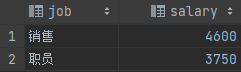

## SQL通用语法
1. SQL语句可以单行或多行书写，以分号结尾
2. SQL语句可以使用空格/tab缩进来增强语句的可读性
3. MYSQL数据库的SQL语句不区分大小写，关键字建议使用大写
4. 注释：
   1. 单行注释：-- 或者 #（MySQL特有） 
   2. 多行注释： /* 注释内容 */

## SQL数据类型
* 数值类型
  **类型**|**大小(Bytes)**|**范围（有符号）**|**范围（无符号）**|**用途**
  -----|-----|-----|-----|-----
  TINYINT|1|(-128，127)|(0，255)|小整数值
  SMALLINT|2|(-32 768，32 767)|(0，65 535)|大整数值
  MEDIUMINT|3|(-8 388 608，8 388 607)|(0，16 777 215)|大整数值
  INT或INTEGER|4|(-2 147 483 648，2 147 483 647)|(0，4 294 967 295)|大整数值
  BIGINT|8|(-9,223,372,036,854,775,808，9 223 372 036 854 775 807)|(0，18 446 744 073 709 551 615)|极大整数值
  FLOAT|4|(-3.402 823 466 E+38，-1.175 494 351 E-38)，0，(1.175 494 351 E-38，3.402 823 466 351 E+38)|0，(1.175 494 351 E-38，3.402 823 466 E+38)|单精度
* 日期和时间类型
  **类型**|**大小(bytes)**|**范围**|**格式**|**用途**
  -----|-----|-----|-----|-----
  DATE|3|1000-01-01/9999-12-31|YYYY-MM-DD|日期值
  TIME|3|'-838:59:59'/'838:59:59'|HH:MM:SS|时间值或持续时间
  YEAR|1|1901/2155|YYYY|年份值
  DATETIME|8|1000-01-01 00:00:00/9999-12-31 23:59:59|YYYY-MM-DD HH:MM:SS|混合日期和时间值
* 字符串类型
  **类型**|**大小**|**用途**
  -----|-----|-----
  CHAR|0-255 bytes|定长字符串
  VARCHAR|0-65535 bytes|变长字符串
  TINYBLOB|0-255 bytes|不超过 255 个字符的二进制字符串
  TINYTEXT|0-255 bytes|短文本字符串
  BLOB|0-65 535 bytes|二进制形式的长文本数据
  TEXT|0-65 535 bytes|长文本数据
  MEDIUMBLOB|0-16 777 215 bytes|二进制形式的中等长度文本数据
  MEDIUMTEXT|0-16 777 215 bytes|中等长度文本数据
  LONGBLOB|0-4 294 967 295 bytes|二进制形式的极大文本数据
  LONGTEXT|0-4 294 967 295 bytes|极大文本数据

## SQL语句分类
| 分类 | 全称 | 说明 |
| -- | -- | -- |
| DDL | Data Definition Language | 数据定义语言，用来定义数据库对象（数据库，表，字段）|
| DML | Data Manipulation Language | 数据操作语言，用来对数据库表中的数据进行增删改 |
| DQL | Data Query Language | 数据查询语言，用来查询数据库中表的记录 |
| DCL | Data Control Language | 数据控制语言，用来创建数据库用户、控制数据库的访问权限 |


## DDL（数据定义语言）
### 数据库操作
```sql
-- 查询所有数据库
show databases;

-- 查询当前所在的数据库
select database();

-- 创建数据库
create database [if not exists] 数据库名称 [default character set 字符集] [collate 排序规则];

-- 删除数据库
drop database [if exists] 数据库名称;

-- 使用数据库
use 数据库名称;
```

附录：新建两张表（dept和emp）
```sql
create table dept(
    id int auto_increment primary key comment 'ID',
    name varchar(50) unique not null comment '部门名称'
) comment '金庸公司部门';

insert into dept (name) values ('研发部'),('市场部'),('财务部'),('销售部'),('总经办'),('人事部');

create table emp(
    id int auto_increment primary key comment 'ID',
    name varchar(10) unique not null comment '用户名',
    age int comment '年龄',
    job varchar(10) comment '工作',
    salary int comment '工资',
    entry_date date comment '入职时间',
    manager_id int comment '所属管理者',
    dept_id int comment '关联部门id'
) comment '职员表';

insert into emp(name, age, job, salary, entry_date, manager_id, dept_id) values
    ('金庸',66,'总裁',20000,'2000-01-01',null,5),
    ('张无忌',20,'项目经理',12500,'2005-12-05',1,1),
    ('杨逍',33,'开发',840,'2000-11-03',2,1),
    ('韦一笑',48,'开发',11000,'2002-02-05',2,1),
    ('常遇春',33,'开发',20000,'2004-09-07',3,1),
    ('小昭',19,'程序鼓励师',6000,'2004-10-12',2,1),
    ('灭绝',60,'财务总监',8500,'2002-09-12',1,3),
    ('周芷若',19,'会计',6000,'2006-06-02',7,3),
    ('丁敏君',23,'出纳',5250,'2009-05-13',7,3),
    ('赵敏',20,'市场部总监',12500,'2004-10-12',1,2),
    ('鹿杖客',56,'职员',3750,'2006-10-03',10,2),
    ('鹤笔翁',19,'职员',3750,'2007-05-09',10,2),
    ('方东白',19,'职员',5500,'2009-02-12',10,2),
    ('张三丰',88,'销售总监',14000,'2004-10-12',1,4),
    ('俞莲舟',38,'销售',4600,'2004-10-12',14,4),
    ('宋远桥',40,'销售',4600,'2004-10-12',14,4),
    ('陈永亮',42,null,2000,'2011-10-12',1,null)
```

### 表结构操作
```sql
-- 查询当前数据库所有表
show tables;

-- 查询表结构
desc 表名;

-- 查询指定表的建表语句
show create table 表名;

-- 创建表
create table 表名(
    字段1 字段1类型 [comment 字段1注释],
    字段2 字段2类型 [comment 字段2注释],
    字段3 字段3类型 [comment 字段3注释],
    ...
    字段n 字段n类型 [comment 字段n注释]
  )[ comment 表注释 ];

-- 添加字段
alter table 表名 add 字段名 类型 [comment '注释'] [约束];

-- 修改某个字段的数据类型
alter table 表名 modify 字段名 类型;

-- 修改某个字段的名称和数据类型（修改名称的时候必须页修改数据类型）
alter table 表名 change 字段名 新字段名 类型 [comment '注释'] [约束];

-- 删除指定字段
alter table 表名 drop 字段名;

-- 修改表名
alter table 表名 rename to 新表名;

-- 删除表（完全删除整张表）
drop table 表名;

-- 删除表，并重新创建该表（相当于清空整张表）
truncate table 表名;
```

## DML（数据操作语言）
### 增加数据
```sql
-- 给指定字段添加数据
insert into 表名 (字段1,字段2,...) values (值1, 值2, ...);

-- 给表中全部字段添加数据
insert into 表名 values (值1, 值2, ...);

-- 给指定字段批量添加数据
insert into 表名 (字段1,字段2,...) values (值1, 值2, ...),(值1, 值2, ...),...;

-- 给表中全部字段批量添加数据
insert into 表名 values (值1, 值2, ...),(值1, 值2, ...),...;
```
备注：字符串和日期类型数据应该包含在引号中

### 删除数据
```sql
delete from 表名 [where 条件]
```

### 修改数据
```sql
update 表名 set 字段名1 = 值1, 字段名2 = 值2, ... [where 条件]
```

## DQL（数据查询语言）
### 基本语法（编写顺序）
```sql
SELECT
    字段列表
FROM
    表名字段
WHERE
    条件列表
GROUP BY
    分组字段列表
HAVING
    分组后的条件列表
ORDER BY
    排序字段列表
LIMIT
    分页参数
```

### 基础查询
```sql
-- 查询多个字段
select 字段1, 字段2, 字段3, ... from 表名;
select * from 表名;

-- 设置别名
select 字段1 [ AS 别名1 ], 字段2 [ AS 别名2 ], 字段3 [ AS 别名3 ], ... from 表名;
select 字段1 [ 别名1 ], 字段2 [ 别名2 ], 字段3 [ 别名3 ], ... from 表名;

-- 去除重复记录
select distinct 字段列表 from 表名;

-- 转义
select * from 表名 where name like '/_门吹雪' escape '/'
-- /之后的_不作为通配符
```
### 条件查询（过滤）
#### 语法
```sql
select 字段列表 from 表名 where 条件列表
```

#### 条件运算符
|**比较运算符**|**功能**|
-----|-----
| > | 大于 | 
|>=|大于等于|
<|小于
<=|小于等于
=|等于
<> 或 !=|不等于
BETWEEN … AND …|在某个范围内（含最小、最大值）
IN(…)|在in之后的列表中的值，多选一
LIKE 占位符|模糊匹配（\_匹配单个字符，%匹配任意个字符）
IS NULL|是NULL

**逻辑运算符**|**功能**
:-----:|:-----:
AND 或 &&|并且（多个条件同时成立）
OR 或 \|\||或者（多个条件任意一个成立）
NOT 或 !|非，不是

```sql
-- 年龄等于30
select * from employee where age = 30;
-- 年龄小于30
select * from employee where age < 30;
-- 小于等于
select * from employee where age <= 30;
-- 没有身份证
select * from employee where idcard is null or idcard = '';
-- 有身份证
select * from employee where idcard;
select * from employee where idcard is not null;
-- 不等于
select * from employee where age != 30;
-- 年龄在20到30之间
select * from employee where age between 20 and 30;
select * from employee where age >= 20 and age <= 30;
-- 下面语句不报错，但查不到任何信息
select * from employee where age between 30 and 20;
-- 性别为女且年龄小于30
select * from employee where age < 30 and gender = '女';
-- 年龄等于25或30或35
select * from employee where age = 25 or age = 30 or age = 35;
select * from employee where age in (25, 30, 35);
-- 姓名为两个字
select * from employee where name like '__';
-- 身份证最后为X
select * from employee where idcard like '%X';
```

### 聚合函数
**函数**|**功能**
----- | -----
count | 统计数量
max | 最大值
min | 最小值
avg | 平均值
sum | 求和

备注：所有的null值是不参与聚合运算的

#### 语法
```sql
select 聚合函数(字段列表) from 表名;
```
通常聚合函数和分组查询来配合来使用的

```sql
-- 统计表中年龄为13的数量
select count(age) from nn where age = 13;

-- 统计表中年龄最大值
select max(age) from emp;

-- 统计表中年龄最小值
select min(age) from emp;

-- 统计表中平均年龄
select avg(age) from emp;

-- 统计表中年龄之和
select sum(age) from emp;
```

### 分组查询
#### 语法
```sql
select 字段列表 from 表名 [where 条件列表] group by 分组字段名 [having 分组后的过滤条件]
```
备注：  
1、_where和having的区别_？  
  * 执行时机不同：where是分组之前进行过滤，不满足where条件不参与分组；having是分组后对结果进行过滤。
  * 判断条件不同：where不能对聚合函数进行判断，而having可以。  

2、执行顺序：where > 聚合函数 > having  
   _分组之后，查询的字段一般为聚合函数和分组字段，查询其他字段无任何意义_

```sql
-- 根据性别分组，统计男性和女性数量
select gender,count(*) from emp group by gender;

-- 根据性别分组，统计男性和女性的平均年龄
select gender,avg(age) from emp group by gender;

-- 年龄小于45，并根据工作地址分组，获取员工数量大于等于3的工作地址
select work_address,count(*) as address_count from emp where age <45 group by work_address having address_count >=3;
```

### 排序查询
#### 语法
```sql
select 字段列表 from 表名 order by 字段1 排序方式1, 字段2 排序方式2;
```
* 升序：asc     （ascending）
* 降序：desc    （descending）
备注：如果是多字段排序，当第一个字段值相同时，才会根据第二个字段进行排序

```sql
-- 根据员工年龄升序排序
select * from emp order by age asc ;

-- 两字段排序，根据年龄升序排序，当年龄相同时，再根据入职时间降序排序
select * from emp order by age asc,entry_date desc;
```

### 分页查询
#### 语法
```sql
select 字段列表 from 表名 limit 起始索引, 查询记录数;
```
备注：
* 起始索引从0开始，起始索引 = （查询页码 - 1） * 每页显示记录数
* 分页查询是数据库的方言，不同数据库有不同实现，MySQL是LIMIT
* 如果查询的是第一页数据，起始索引可以省略，直接简写 LIMIT 10

```sql
select * from emp limit 10;
select * from emp limit 10,10;
```

### DQL执行顺序
**from -> where -> group by -> select（聚合函数） -> having -> order by -> limit**  
```sql
select gender,avg(age) result from emp where age between 20 and 66 group by gender having result < 50;
```
备注：后执行的可以使用前面的别名


## DCL（数据控制语言）
* 管理用户
  ```sql
  -- 创建用户
  create user '用户名'@'主机名' identified by '密码';

  -- 修改用户密码
  alter user '用户名'@'主机名' identified with mysql_native_password by '新密码'

  -- 删除用户
  drop user '用户名'@'主机名'

  -- 创建用户test，能在任意主机访问
  create user 'test'@'%' identified by '123456';
  ```
* 权限控制
  **权限**|**说明**
  -----|-----
  ALL, ALL PRIVILEGES|所有权限
  SELECT|查询数据
  INSERT|插入数据
  UPDATE|修改数据
  DELETE|删除数据
  ALTER|修改表
  DROP|删除数据库/表/视图
  CREATE|创建数据库/表

  ```sql
  -- 查询权限
  show grants for '用户名'@'主机名';

  -- 授予权限
  grant 权限列表 on 数据库名.表名 to '用户名'@'主机名';
  grant select on *.* to 'heima'@'%';

  -- 撤销权限
  revoke all on 数据库名.表名 from '用户名'@'主机名';
  ```

## 函数
参见：https://www.w3schools.com/mysql/mysql_ref_functions.asp

## 约束
用来限制表结构中所存储的数据的，作用域表的字段
**约束** | **描述** | **关键字**
-----|-----|-----
非空约束 | 限制该字段的数据不能为null | NOT NULL
唯一约束 | 保证该字段的所有数据都是唯一、不重复的 | UNIQUE
主键约束 | 主键是一行数据的唯一标识，要求非空且唯一 | PRIMARY KEY
默认约束 | 保存数据时，如果未指定该字段的值，则采用默认值 | DEFAULT
检查约束（8.0.16版本后）|保证字段值满足某一个条件 | CHECK
外键约束 | 用来让两张图的数据之间建立连接，保证数据的一致性和完整性 | FOREIGN KEY

```sql
-- 新建表的时候，对字段添加约束
create table nn_child
(
    id           int auto_increment comment '主键ID',
    name         varchar(10) default '' not null comment '姓名',
    child_parent int                    null comment '外键ID',
    constraint nn_child_pk
        primary key (id),
    constraint fd_child_parent
        foreign key (child_parent) references nn_parent (manager_id)
)
    comment 'nn表的子表';

-- 建完表之后，对字段添加外键约束
alter table 表名 add constraint 外键名称 foreign key(from字段) references dept(to字段);

-- 删除外键
alter able 表名 drop foreign key 外键名
```
当外键关联的字段删除/更新时
**行为** | **说明**
----- | -----
NO ACTION | 当在父表中删除/更新对应记录时，首先检查该记录是否有对应外键，如果有则不允许删除/更新（与RESTRICT一致）
RESTRICT | 当在父表中删除/更新对应记录时，首先检查该记录是否有对应外键，如果有则不允许删除/更新（与NO ACTION一致）
CASCADE | 当在父表中删除/更新对应记录时，首先检查该记录是否有对应外键，如果有则也删除/更新外键在子表中的记录
SET NULL | 当在父表中删除/更新对应记录时，首先检查该记录是否有对应外键，如果有则设置子表中该外键值为null（要求该外键允许为null）
SET DEFAULT | 父表有变更时，子表将外键设为一个默认值（Innodb不支持）

```sql
alter table 表名 add constraint 外键名称 foreign key (外键字段) references 主表名(主表字段名) on update 行为 on delete 行为;
```


## 多表查询
### 多表关系
* 一对多（多对一）
  * 案例：部门与员工
  * 关系：一个部门对应多个员工，一个员工对应一个部门
  * 实现：在多的一方简历外键，指向一的一方的主键
* 多对多
  * 案例：学生与课程
  * 关系：一个学生可以选多门课程，一门课程也可以供多个学生选修
  * 实现：建立第三张中间表，中间表至少包含两个外键，分别关联两方主键
* 一个一
  * 案例：用户与用户详情
  * 关系：一对一关系，多用于单表拆分，将一张表的基础字段放在一张表中，其他详情字段放在另一张表中，以提升操作效率
  * 在任意一方加入外键，关联另外一方的主键，并且设置外键为唯一的（UNIQUE）

### 基本查询
```sql
-- 合并查询（笛卡尔积，会展示所有组合结果）
-- 笛卡尔积：两个集合A集合和B集合的所有组合情况（在多表查询时，需要消除无效的笛卡尔积）
select * from 表1, 表2;

-- 通过多个表建立连接关系的字段，可以消除无效的笛卡尔积
-- 下面表1 和表2 是通过字段1和字段2 建立联系的，所以可以通过 条件 “表1.字段1 = 表2.字段2”，可以消除无效的笛卡尔积
select * from 表1, 表2 where 表1.字段1 = 表2.字段2;
```
### 内连接查询
查询两张表交集的部分
#### 隐式内连接
```sql
select 字段列表 from 表1, 表2 where 条件列表（连接条件—通过连接条件消除笛卡尔积）;
select e.name, d.name from emp e, dept d where e.dept_id=d.id;
```

#### 显示内连接
```sql
select 字段列表 from 表1 [inner] join 表2 on 条件列表（连接条件—通过连接条件消除笛卡尔积）;
select e.name,d.name from emp e inner join dept d on e.dept_id=d.id;
```
备注：显式性能比隐式高

### 外连接查询
#### 左外连接
查询左表所有数据，以及两张表交集部分数据
```sql
select 字段列表 from 表1 left [outer] join 表2 d on 条件列表（连接条件—通过连接条件消除笛卡尔积）;
```

#### 右外连接
查询右表所有数据，以及两张表交集部分数据
```sql
select 字段列表 from 表1 right [outer] join 表2 d on 条件列表（连接条件—通过连接条件消除笛卡尔积）;
```

### 自连接查询
当前表与自身的连接查询，自连接必须使用表别名（自连接查询，可以是内连接查询，也可以是外连接查询）
```sql
select 字段列表 from 表1 别名1 join 表2 表名2 on 条件列表（连接条件—通过连接条件消除笛卡尔积）;

-- 查询员工及其所属领导的名字
select a.name,b.name from emp a, emp b where a.manager_id=b.id;

-- 查询员工及其所属领导的名字(如果员工没有领导，也需要查询出来)
select a.name,b.name from emp a left join emp b on a.manager_id=b.id;
```

### 联合查询
把多次查询的结果合并，形成一个新的查询结果集
```sql
select 字段列表 from 表1 ...
union [all]
select 字段列表 from 表2 ...

-- 查询薪资低于500，和年龄大于50岁的员工全部查询出来
select * from emp where salary < 5000
union all
select * from emp where age > 50;

-- 去除重复
select * from emp where salary < 5000
union
select * from emp where age > 50;
```

备注：
* UNION ALL 会有重复结果，UNION 不会
* 联合查询比使用or效率高，不会使索引失效
* 联合查询的多张表的列数必须保持一致，字段类型也需要保持一致

### 子连接查询
SQL语句中嵌套的select语句，称为嵌套查询，又称子查询。（就是下面语法中在小括号里的查询，叫子查询）
```sql
select * from 表1 where 字段 = (select 字段 from 表2);
-- 注意：括号外面的查询语句可以是insert / update / delete / select中的任何一个
```

1. 根据子查询结果不同，分为：
* 标量子查询（子查询结果为单个值，相当于子查询的结果是excel中的单元格）  
  常用操作符：```- != > >= < <=```
  ```sql
  -- 查询“销售部”的所有员工信息
  select * from emp where dept_id = (select id from dept where name='销售部');

  -- 查询在“方东白”入职之后入职的员工信息
  select * from emp where entry_date > (select entry_date from emp where name='方东白');
  ```

* 列子查询（子查询结果为一列，相当于子查询的结果是excel中的一列）  
  常用操作符：
  **操作符** | **描述**
  ----- | -----
  IN | 在指定的集合范围内，多选一
  NOT IN | 不在指定的集合范围内
  ANY | 子查询返回列表中，有任意一个满足即可
  SOME | 与ANY等同，使用SOME的地方都可以使用ANY
  ALL | 子查询返回列表的所有值都必须满足
  ```sql
  -- 查询“销售部”和“市场部”的所有员工信息
  select * from emp where dept_id in (select id from dept where name='销售部' or name='市场部');

  -- 查询比“财务部”所有人工资都高的员工信息
  select * from emp where salary > all(select salary from emp where dept_id = (select id from dept where name='财务部'));

  -- 查询比“研发部”中任意一人工资高的员工信息
  select * from emp where salary > all (select salary from emp where dept_id = (select id from dept where name='研发部'));
  ```

* 行子查询（子查询结果为一行，相当于子查询的结果是excel中的一行）  
  常用操作符：```= != IN NOT IN```
  ```sql
  -- 查询与“张无忌”的薪资及直属领导相同的员工信息
  select * from emp where (salary,manager_id)=(select salary,manager_id from emp where name='张无忌');
  ```

  #### 表子查询（子查询结果为多行多列，相当于子查询的结果是excel中的区域选择）
  常用操作符：```in```
  ```sql
  -- 查询与“鹿杖客”，“宋远桥”的职位和薪资相同的员工信息
  select * from emp where (job,salary) in (select job, salary from emp where name='鹿杖客' or name='宋远桥');

  -- 查询入职日期是“2006-01-01”之后的员工信息，及其部门信息
  ```
  解读：第一个例子中，```select job, salary from emp where name='鹿杖客' or name='宋远桥'```返回结果如下  
    
  可以看到这张生成的临时子表，有两行数据。from emp where (job,salary) in 表示 在emp表每一行的(job,salary)先匹配第一行，再匹配第二行...，只要匹配的上，就会显示出来 

2. 根据子查询位置，分为：where之后、from之后、select之后

附录：
```sql
create table salgrade(
    grade int,
    losal int,
    hisal int
) comment '薪资等级表';

insert into salgrade values (1,0,3000);
insert into salgrade values (2,3001,5000);
insert into salgrade values (3,5001,8000);
insert into salgrade values (4,8001,10000);
insert into salgrade values (5,10001,15000);
insert into salgrade values (6,15001,20000);
insert into salgrade values (7,20001,25000);
insert into salgrade values (8,25001,30000);

-- 查询员工的姓名、年龄、职位和部门信息（隐式连接）
select e.name,e.age,e.job,d.name from emp e, dept d where e.dept_id=d.id;

-- 查询年龄小于30岁的员工的姓名、年龄、职位和部门信息（显示内连接）
select e.name,e.age,e.job,d.name from emp e inner join dept d on e.dept_id = d.id where e.age < 30

-- 查询拥有员工的部门ID、部门名称
select distinct d.id,d.name from emp e inner join dept d on e.dept_id = d.id;

-- 查询所有年龄大于40随的员工，及其归属的部门名称；如果员工没有分配部门，也需要展示出来
select e.name,d.name from emp e left join dept d on e.dept_id=d.id where e.age > 40;

-- 查询所有员工的薪资等级
select e.name,s.grade from emp e inner join salgrade s on e.salary between s.losal and s.hisal order by s.grade desc;

-- 查询研发部所有员工的信息及工资等级
select * from emp e inner join salgrade s on e.salary between s.losal and s.hisal where e.dept_id = (select id from dept where name='研发部') order by s.grade desc, e.age desc;
-- 或者
select e.*, s.grade
from emp e,
     dept d,
     salgrade s
where e.dept_id = d.id
  and (e.salary between s.losal and s.hisal)
  and d.name = '研发部'

-- 查询研发部员工的平均工资
select avg(salary) from emp e inner join dept d on e.dept_id = d.id and d.name='研发部';

-- 查询工资比“灭绝”高的员工信息
select * from emp where salary > (select salary from emp where name='灭绝');

-- 查询比平均薪资高的员工信息
select * from emp where salary > (select avg(salary) from emp);

-- 查询低于本部门平均工资的员工信息
select * from emp e2 left join dept d on d.id = e2.dept_id where e2.salary < (select avg(e1.salary) from emp e1 where e1.dept_id=e2.dept_id);

--查询所有的部门信息，并统计部门的员工人数
select d.name '部门', count(*) '人数' from emp e left join dept d on d.id = e.dept_id group by d.name;

-- 查询所有学生的选课情况，展示出学生名称，学号，课程名称
select s.name,s.no,c.name from student s , student_course sc, course c where s.id=sc.studentid and sc.courseid=c.id
```


## 事务
事务是一组操作的集合，事务会把所有操作作为一个整体一起向系统提交或撤销操作请求，即这些操作**要么同时成功，要么同时失败**。
备注：默认MySQL的事务是自动提交的。也就是说，当执行一条DML语句时，MySQL会立即隐式的提交事务

### 事务操作
* 方式一
  ```sql
  -- 查看事务提交方式
  select @@AUTOCOMMIT;
  -- 设置事务提交方式，1为自动提交，0为手动提交，该设置只对当前会话有效
  set @@AUTOCOMMIT = 0;
  -- 提交事务（没有出错）
  commit;
  -- 回滚事务（当出错的时候）
  rollback;
  ```
* 方式二
  ```sql
  -- 开启事务
  start transaction -- 或者 begin
  -- 提交事务
  commit;
  -- 回滚事务
  rollback;
  ```
### 事务的四大特性
1. 原子性(Atomicity)：事务是不可分割的最小操作单元，要么全部成功，要么全部失败
2. 一致性(Consistency)：事务完成时，必须使所有数据都保持一致状态
3. 隔离性(Isolation)：数据库系统提供的隔离机制，保证事务在不受外部并发操作影响的独立环境下运行
4. 持久性(Durability)：事务一旦提交或回滚，它对数据库中的数据的改变就是永久的

### 并发事务引发的问题
**问题** | **描述**
----- | -----
脏读 | 一个事务读到另一个事务还没提交的数据
不可重复读 | 一个事务先后读取同一条记录，但两次读取的数据不同
幻读 | 一个事务按照条件查询数据时，没有对应的数据行，但是在插入数据时，又发现这行数据已经存在

### 事务的隔离级别
**隔离级别** | **脏读** | **不可重复读** | **幻读**
----- | ----- | ----- | -----
Read uncommitted | √ | √ | √
Read committed | × | √ | √
Repeatable Read(默认) | × | × | √
Serializable | × | × | ×

* √ 表示在当前隔离级别下该问题会出现 × 表示不会出现
* Serializable 性能最低；Read uncommitted 性能最高，数据安全性最差
```sql
-- 查看事务隔离级别
SELECT @@TRANSACTION_ISOLATION;

-- 设置事务隔离级别
-- SESSION 是会话级别，表示只针对当前会话有效，GLOBAL 表示对所有会话有效
SET [ SESSION | GLOBAL ] TRANSACTION ISOLATION LEVEL {READ UNCOMMITTED | READ COMMITTED | REPEATABLE READ | SERIALIZABLE };
```
