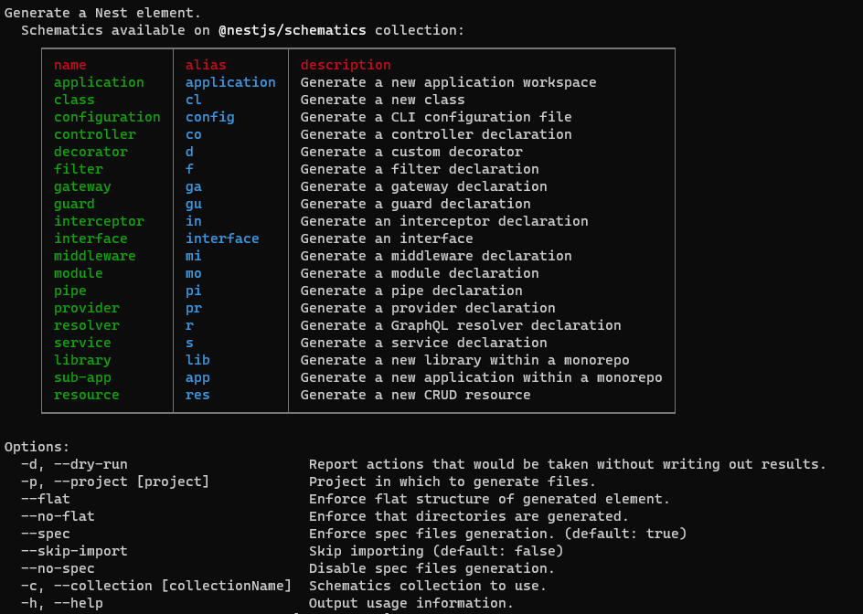

## 简介
Nest (NestJS) 是一个用于构建高效、可扩展的 Node.js 服务器端应用程序的开发框架。它利用 JavaScript 的渐进增强的能力，使用并完全支持 TypeScript （仍然允许开发者使用纯 JavaScript 进行开发），并结合了 OOP （面向对象编程）、FP （函数式编程）和 FRP （函数响应式编程）

### 安装全局nest命令
nest必须满足node.js版本(>=12，除了13版本之外)
```shell
$ npm i -g @nestjs/cli
```

### 命令详解


## Controllers
负责处理传入的请求并将响应返回给客户端

