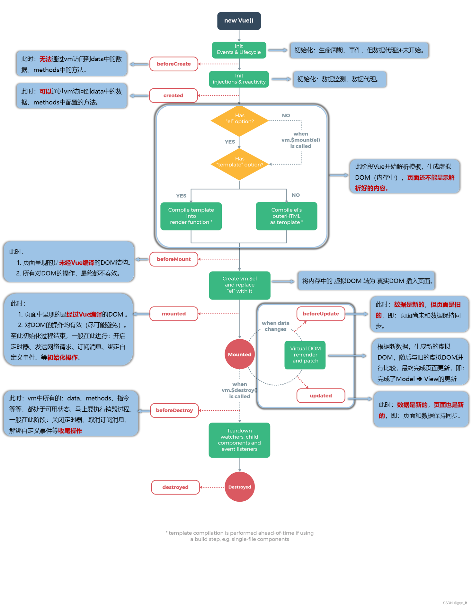

# Vue2

## 初识
1. 想让vue工作，就必须创建一个vue实例，切要传入一个配置对象
2. root容器里的代码依然符合html规范，只不过混入了一些特殊的vue语法
3. root容器里的代码被称为【vue模板】
4. Vue实例和容器是一一对应的
5. 真实开发中只有一个Vue实例，并且会配合着组件一起使用
6. {{XXX}}中的xxx是**js表达式**，或者vue实例和原型上的都可以读取到
7. 一旦data中的数据发生变化，那么页面中用到该数据的地方也会自动更新：
8. 注意区分：js表达式和js代码（语句）
   * 表达式：一个表达式会产生一个值，可以放在任何一个需要值的地方
     * a
     * a + b
     * demo(1)
     * x === y ? 'a' : 'b'
   * js代码（语句）
     * if(){}
     * for(){}
9. **data中任意数据发生变化的时候，vue的模板将会重新解析一遍。也就是说任意数据发生变化时，模板中的方法都将被执行一遍**（模板中的过滤器也将会被执行一遍）

## 模板
模板包括下面的语法：
* 插值语法  {{}}    
  * 功能：用于解析标签体内容
  * 写法：{{xxx}} xxx是**js表达式**，或者vue实例和原型上的都可以读取到
* 指令语法 
  * 功能：用于解析标签（包括：标签属性、标签体内容、绑定事件......）
  * 举例：v-bind:href='xxx'或简写为:href='xxx'，xxx同样要写**js表达式**，且可以直接读取到data中的所有属性（**_带冒号，后面就是js表达式，如果不带冒号，后面就是字符串_**）

## 数据绑定
1. 单向数据绑定（v-bind）  
   数据只能从data流向页面
2. 双向数据绑定 v-model  
   数据不仅能从data流向页面，还可以从页面流向data
   * 双向绑定一般应用于表单类元素伤（如：input、select等）
   * v-model:value可以简写为v-model，因为v-model默认收集的就是value值

## 数据代理
通过一个对象代理对另一个对象中属性的操作（读/写）

vue2中的数据代理
1. 通过vm对象来代理data对象中的属性操作（读/写）
2. 能够更加方便的操作data中的数据
3. 基本原理：  
   通过Object.defineProperty把data对象中所有属性添加到vm上。为每一个添加到vm上的属性，都指定一个getter/setter。在getter/setter内部去操作（读/写）data中对应的树形

## 事件处理
基本使用：
1. 使用v-on:XXX或@XXX绑定事件，其中XXX是事件名
2. 事件的回调需要配置在methods对象中，最终会出现在vm上
3. methods中配置的函数，不要用箭头函数！否则this就不是vm了
4. methods中配置的函数，都是被Vue所管理的函数，this的指向是vm或组件实例对象
5. @click='demoMethod' 和 @click='demoMethod($event)'效果一致，但后者可以传参

事件修饰符：
1. prevent：阻止默认事件（常用）
2. stop：阻止事件冒泡（常用）
3. once：事件只触发一次（常用）
4. capture：使用事件的捕获模式
5. self：只有event.target是当前操作的元素才触发事件
6. passive：事件的默认行为立即执行，无需等待事件回调执行完毕
   
键盘事件：
1. 常用按键别名：  
   回车  =>  enter  
   删除  =>  delete  （捕获“删除”和“退格”键）  
   退出  =>  esc  
   空格  =>  space  
   换行  =>  tab  （特殊，必行配合keydown使用）
   上    =>  up  
   下    =>  down  
   左    =>  left  
   右    =>  right  

2. Vue中未提供别名的按键，可以使用按键原始的key和keyCode去绑定，当要注意转换为kebab-case（短横线命名）
   
3. 系统修饰键（用法特殊）：ctrl、alt、shift、win  
   (1). 配合keyup使用：按下修饰键的同时，再按下其他键，随后释放其他键，事件才被触发  
   (2). 配合keydown使用：正常触发事件

4. 可以使用keyCode去指定具体的按键（不推荐 @deprecated）
   
5. 通过Vue.config.keyCodes.自定义键名 = 键码，可以定制按键别名

备注：
1. keyup：按下去抬起键盘，才能触发
2. keydown：按下去不用抬起按键，即可触发
3. @click.stop.prevent：表示先阻止冒泡再阻止默认行为


## 计算属性
要用的属性不存在，要通过**已有属性**计算得来

1. 原理  
底层借助了Object.defineProperty方法提个的getter和setter

2. get函数何时执行？  
  * 初次读取时会执行一次  
  * 当依赖的数据发生变化时会被再次调用

3. 优势  
与methods实现相比，内部有缓存机制（复用），效率更高，调试方便  


备注：
1. 计算属性最终会出现在vm上，直接读取使用即可
2. 如果计算属性要被修改。那必须设置setter去修改，且setter里面必须修改计算所依赖的数据


## 监视属性
深度监视：  
* Vue中的watch 默认不监测对象内部值以及数组元素的改变（它只监测对象和数组是否被重新赋值，在第一层）  
* 配置deep:true 可以监测对象内部值以及数组元素的改变  

备注：  
* Vue自身可以监测对象内部值的改变，但Vue提供的watch默认不可以
* 使用watch时根据数据的具体结构，决定是否采用深度监视

computed和watch之间的区别：
1. computed能完成的功能，watch都可以完成
2. watch能完成的功能，computed不一定能完成，例如：watch可以进行异步操作


**_两个重要的小原则_**：  
> 所有被Vue管理的函数，最好写成普通函数。这样this的指向才是vm或组件实例对象  
> 所有不被Vue锁管理的函数（定时器的回调函数、ajax的回调函数等）。最好写成箭头函数，这样的this指向才能使vm或组件实例对象

## 绑定样式
1. class样式  
   :class='XXX' XXX可以是字符串、对象、数组  
   * 字符串写法适用于：类名不确定，要动态获取
   * 数组写法适用于：要绑定多个样式，个数不确定，名字不确定
   * 对象写法适用于：要绑定多个样式，个数确定，名字也确定，但不确定用不用

2. style样式
   * :style="{fontSize: XXX}"其中XXX是动态值
   * :style="[a,b]"其中a、b是样式对象

## 条件渲染
**template只能与v-if配合使用，不能和v-show一起使用**

## 列表循环
* 遍历数组
  ```html
  <li v-for="(value, index) in arr" :key="index">
    {{value}}--{{index}}
  </li>
  ```
* 遍历对象
  ```html
  <li v-for="(value, index) in obj" :key="index">
    {{value}}--{{index}}
  </li>
  ```
* 遍历字符串（很少用）
  ```html
  <li v-for="(value, index) in 'abcdefg'" :key="index">
    {{value}}--{{index}}
  </li>
  ```
* 遍历指定次数（很少用） 
  ```html
  <li v-for="(value, index) in 10" :key="index">
    {{value}}--{{index}}
  </li>
  ```

## Vue监测数据
通过数据劫持（defineProperty）

1. Vue会监视data中所有层次的数据
2. 如何监视对象中的数据？
   1. 通过setter实现监视，切要在new Vue时就传入要监测的数据
   2. 对象中后追加的树形，Vue默认不做响应式处理
   3. 如需给后追加的树形做响应式，请使用如下API：
      * Vue.set(target, propertyName/index, value)或
      * vm.$set(target, propertyName/index, value)
3. 如何监测数组中的数据？
   通过包装数组更新元素的方法实现，本质就是做了两件事：
   * 调用原生对应的方法对数组进行更新
   * 重新解析模板，进而更新页面
4. Vue中修改数组中的某个元素一定要用如下的方法
   * push()、pop()、shift()、unshift()、splice()、sort()、reverse()
   * Vue.set()或vm.$set()

注意：Vue.set()或vm.$set()不能给vm或vm的根数据对象添加属性

备注：[数据代理和数据劫持区别](https://blog.csdn.net/qq_45890970/article/details/124017565)


## 收集表单数据
1. 若```<input type='text'>```，则v-model收集的是value值，用户输入的就是value值
2. 若```<input type='radio'>```，则v-model收集的是value值，且要给标签配置value值
3. 若```<input type='checkbox'>```
   * 没有配置input的value属性，那么收集的就是checked（勾选 or 未勾选，是布尔值）
   * 若配置了input的value属性：
     1. v-model的初始值是非数组，那么收集的就是checked（勾选 or 未勾选，是布尔值）
     2. v-model的初始值是数组，那么收集的就是value组成的数组

备注：  
v-model的三个修饰符：  
* lazy：失去焦点再收集数据
* number：输入字符串转为有效的数字
* trim：输入首尾空格过滤

## 过滤器
对要现实的数据进行特定格式化后再显示（适用于一些简单逻辑的处理）

语法：  
* 注册过滤器：Vue.filter(name, callback) 或 new Vue({filters:{}})
* 使用过滤器：{{xxx | 过滤器名}} 或 v-bind:属性='xxx | 过滤器名'

备注：  
* 过滤器也可以接收额外参数（前面一个传入的参数默认是第一个参数）、多个过滤器可以串联
* 并没有改变原本的数据，是产生新的对应的数据


## 内置指令
### v-text
向其所在的节点中渲染文本内容（也就是将其所在节点的innerHTML，替换成文本）

注意：  
与插值语法的区别：v-text会替换掉节点中的内容（以文本的形式，不支持html结构的解析），插值语法则不会
```html
<div class='blue'>
  <p v-text='parseText'></p>
</div>

<!-- 
new Vue({
  data(){
    return {
      parseText: '显示我'
    }
  }
})

<div class='blue'>
  <p v-text='parseText'></p>
</div>渲染的结果是
<div class='blue'>
  <p>显示我</p>
</div>
-->
```

### v-html
将其所在节点的innerHTML替换成渲染包含html结构的内容。它可以识别解析html结构。

v-html有安全性问题  
* 在网站上动态渲染任意html是非常危险的，容易导致xss攻击
* 一定要在可信的内容上使用v-html，永远不要在用户提交的内容上使用！

```html
<div class='blue'>
  <p v-text='parseText'></p>
</div>

<!-- 
new Vue({
  data(){
    return {
      parseText: '<h3>显示我</h3>'
    }
  }
})

<div class='blue'>
  <p v-text='parseText'></p>
</div>渲染的结果是
<div class='blue'>
  <p>
    <h3>显示我</h3>
  </p>
</div>
-->
```

### v-cloak
* 该指令没有值，本质是一个特殊属性，vue实例创建完毕接管容器后，会删掉v-cloak属性
* 使用css配合v-cloak可以解决网速慢时页面展示出{{xxx}}的问题
```css
[v-cloak]{
  display: none
}
```

### v-once
* v-once所在节点在初次动态渲染后，就视为静态内容了
* 以后数据的改变不会引起v-once所在结构的更新，可以用于优化性能

### v-pre
* 让vue跳过其所在节点的编译过程
* 可利用它跳过：没有使用指令语法、没有使用插值语法的节点，会加快编译

## 自定义指令
1. 定义语法
   ```js
   // 局部指令：
      new Vue({
        directives:{
          指令名称:{
            bind(element,binding){},
            inserted(element,binding){},
            update(element,binding){},
          }
        }
      })
      // 或者
      new Vue({
        directives:{
          '指令名'(element,binding){}
        }
      })
   // 全局指令：
      Vue.directive(指令名称, 配置对象) 或者 Vue.directive(指令名称, 回调函数)

   /**
    * 上述element，表示指令所绑定的标签元素（dom元素），binding表示vue给指定提供的数据信息，其内容如下：
    {
      def: {bind: ƒ, update: ƒ}
      expression: "n"   // 指令绑定的vue的data中的变量
      modifiers: {}
      name: "big"       // 指令名称
      oldArg: undefined
      oldValue: 1
      rawName: "v-big"  // 调用指令时使用的名称
      value: 1          // 指令绑定的vue的data中的变量值
    }
    */
   ```
2. 配置对象中常用的3个回调
   * bind：指令与元素成功绑定时调用
   * inserted：指令所在元素被插入页面时调用
   * update：指令所在模板结构被重新解析时调用

备注：
1. 指令定义时不加v-，但使用时要加v-;
2. 指令名如果是多个单词，要使用kebab-case命名方式，不要用cameCase命名方式
```js
new Vue({
  el:'#root',
  data:{
    n:1
  },
  directives:{
    big(element, binding){
      element.innerText=binding.value*10
    }
  }
})


```
自定义的指令函数何时会被调用？
* 指令与元素成功绑定时
* 指令所在的模板被重新解析时


## 生命周期


---

## 模块与组件、模块化与组件化
组件：用来实现局部（特定）功能效果的代码集合

### 非单文件组件
一个文件中包含有n个组件

Vue中使用组件的三大步骤：
1. 定义组件（创建组件）  
   Vue.extend(options)创建，其中options和new Vue(options)时传入的那个options几乎一样，但也有点区别：
   * el不要写，因为所有的组件都要经过vm的管理，由vm的el决定服务哪个容器
   * data必须写成函数，避免组件被复用时，数据存在引用关系  
  
   备注：此时使用template可以配置组件结构
2. 注册组件  
   * 局部注册：靠new Vue时传入的components选项
   * 全局注册：靠Vue.component('组件名', 组件)
3. 使用组件（写组件标签）


> 一个重要的内置关系：VueComponent.prototype.__proto__ === Vue.prototype为真  
> 这样是为了让组件实例对象可以访问到Vue原型上的属性和方法

### 单文件组件
一个文件中只包含有1个组件

## 关于不同版本的Vue
1. vue.js与vue.runtime.xxx.js的区别：
   * vue.js是完整版的Vue，包含：核心功能+模板解析器
   * vue.runtime.xxx.js是运行版的Vue，只包含：核心功能，没有模板解析器
2. 因为vue.runtime.xxx.js没有模板解析器，所以new Vue时不能使用template配置项，需要使用render函数接收到的createElement函数去指定具体内容

## mixin（混入）
功能：可以把多个组件公用的配置提取成一个混入对象

第一步：定义混合，例如：
```js
{
  data(){
    ......
  },
  methods:{}
  ......
}
```
第二步：使用混入，例如：
* 全局混入：Vue.mixin(xxx)
* 局部混入：mixins:['xxx']

## 插件
用于增强Vue，本质就是包含install方法的一个对象，install的第一个参数是Vue，第二个以后的参数是插件使用者传递的数据

第一步，定义插件：
```js
对象.install=function(Vue, options){
  // 添加全局过滤器
  Vue.filter()

  // 添加全局指令
  Vue.directive()

  // 添加全局混入
  Vue.mixin()

  // 添加实例方法
  Vue.prototype.$myMethod = function(){}
  Vue.prototype.$myProperty = xxx
}
```
第二步，使用插件：
Vue.use()


## 组件化编码流程
1. 实现静态组件：抽取组件，使用组件实现静态页面效果
2. 展示动态数据，实现动态组件：考虑好数据的存放位置，数据是一个组件在用，还是一些组件在用
   1. 一个组件在用：放在组件自身即可
   2. 一些组件在用：放在他们共同的父组件上（状态提升）
3. 交互——从绑定事件监听开始


## 父子组件通信
1. 通过props，父组件传递给子组件一个函数类型的props
2. 通过自定义事件
3. 通过ref，父组件中```this.$ref.child.$on```
4. 事件总线
5. 消息订阅和发布

备注：
* 组件上页可以绑定原生DOM事件，需要使用native修饰符
* 通过```this.$refs.xxx.$on(事件名, 回调函数)```绑定自定义事件时，回调要么配置在methods中，要么使用箭头函数，否则this指向会出问题


## vue动画
1. 准备好样式
   * 元素进入样式
     1. v-enter 进入的起点
     2. v-enter-active 进入过程中
     3. v-enter-to 进入的终点
   * 元素离开的样式
     1. v-leave  离开的起点
     2. v-leave-active 离开过程中
     3. v-leave-to 离开的终点

2. 使用```<transition>```包裹要过度的元素，并配置name属性
3. 若有多个元素需要过度，则需要使用```<transition-group>```，且每个元素都要指定key值


## Vue脚手架配置代理
跨域解决方法
1. cors
2. jsonp  只能解决（get请求跨域）
3. 开发时配置代理

方法一
```js
devServer:{
  proxy:'http://localhost:5000'
}
```
说明：
* 优点：配置简单，请求资源时直接发给前端即可
* 缺点：不能配置多个代理，不能灵活的控制请求是否走代理
* 工作方式：若安找上面配置代理，当请求了前端不存在的资源时，那么该请求会转发给服务器（有限匹配前端资源）


方法二
```js
module.exports={
  devServer: {
    port: 9999,
    open: true,
    overlay: {
      warnings: false,
      errors: true,
    },
    proxy: {
      '/api': {
        target: require('./public/config/env.json').api,
        changeOrigin: true, // changeOrigin设置为true时，服务器收到的请求头中的host为伪造的端口；为false，服务器收到的请求头中的host为真实的端口。默认为true
        ws:true,  // websocket 默认为true
        pathRewrite: {
          '^/api': require('./public/config/env.json').proxyURL,
        },
      },
    },
    // before: require('./src/libs/mock/index')
  },
}
```
说明：
* 优点：可以配置多个代理，且可以灵活的控制请求是否走代理
* 缺点：配置略微繁琐，请求资源时必须加前缀

## 插槽
slot标签，slot属性，slot指令
1. 作用：让父组件可以向子组件指定位置插入html结构，也是一种组件间通信的方式，适用于 父组件 ===> 子组件
2. 分类：默认插槽，具名插槽，作用域插槽
3. 使用方式：
   ```html
   <!-- 1. 默认插槽 -->
   <!-- 父组件中 -->
   <Category>
      <div>html结构1</div>
   </Category>

   <!-- 子组件中 -->
   <template>
      <div>
        <!-- 定义插槽 -->
        <slot>插槽默认内容。。。（可以不写）</slot>
      </div>
   </template>


   <!-- 2. 具名插槽 -->
   <!-- 父组件中 -->
   <Category>
      <div slot="center">html结构1</div>

      <template v-slot:footer> <!-- v-slot只能用于template -->
        <div>html结构2/div>
      </template>
   </Category>

   <!-- 子组件中 -->
   <template>
      <div>
        <!-- 定义插槽 -->
        <slot name="center">插槽默认内容。。。（可以不写）</slot>
        <slot name="footer">插槽默认内容。。。（可以不写）</slot>
      </div>
   </template>


   <!-- 2. 作用域插槽 -->
   TODO: 数据在组件的自身，但根据数据生成的结构需要组件的使用者来决定。
   作用域插槽也可以起名字，跟上面具名插槽的设置一致
   <!-- 父组件中 -->
   <Category>
      <template scope="scopeData"> <!-- v-slot只能用于template -->
        <ul>
          <li v-for="g in scopeData.games" :key="g">{{g}}</li>
        </ul>
      </template>
   </Category>

   <!-- 子组件中 -->
   <template>
      <div>
        <!-- 定义插槽 -->
        <slot :games="games" :msg="msg"></slot> <!-- 在父组件中可以接收到games和msg这两个数据 -->
      </div>
   </template>
   <script>
    export default{
      data(){
        return {
          games:['XXX','XXXX'],
          msg:'hello world'
        }
      }
    }
   </script>
   ```


## vuex的四个map方法
1. mapState方法，用于帮助我们映射state中的数据为计算属性
   ```js
   computed:{
    // 对象写法
    ...mapState({sum:'sum', school:'school', subject:'subject'}),

    // 数组写法
    ...mapState(['sum','school','subject'])
   }
   ```
2. mapGetters方法，用于帮助我们映射getters中的数据为计算属性
   ```js
   computed:{
      // 对象写法
    ...mapGetters({bigSum:'bigSum'}),

    // 数组写法
    ...mapGetters(['bigSum'])
   }
   ```
3. mapMutations
4. mapActions

备注：mapActions与mapMutations使用时，若需要传递参数。盱眙在模板中绑定事件时传递好参数，否则参数是事件对象

## vue-router
路由器两种工作模式：
* hash（默认）  
  1. 对一个url来说，什么是hash值？——#及其后面的内容就是hash值
  2. hash值不会包含在http请求中，即：hash值不会传递给服务器  
     例如：在浏览器地址中输入url http://192.168.0.205:7080/bzbb/#/login
     
     
     **通过上面的截图，可以清楚的看到。hash值没有包含在http请求中**
* history 

区别：  
1. hash模式带#号，不美观。而history不带#，地址干净，美观；
2. hash模式若以后将地址通过第三方手机app分享，若app校验严格，则地址会被标记为不合法。而history不会；
3. hash模式兼容性较好，而history兼容性和hash模式相比略差；
4. 应用部署上线时，hash可以直接使用。而history模式需要后端人员支持，解决刷新页面服务器404问题

备注：
1. this.$router和我们新建的router实例，使用起来完全一样。使用this.\$router的原因是我们不想在每个独立需要封装路由的组件中都导入路由


|          | Vue2                  | Vue3 | 备注                                                        |
| -------- | --------------------- | ---- | ----------------------------------------------------------- |
| 数据代理 | Object.defineProperty | ...  | 数据代理：通过一个对象代理对另一个对象中属性的操作（读/写） |


