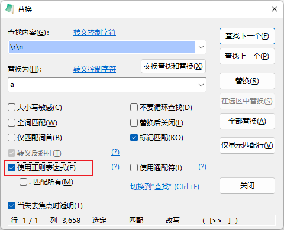
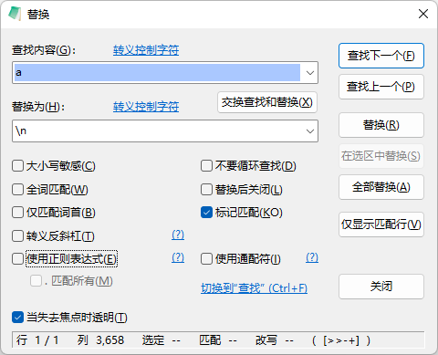

## 第一步：生成字符画
打开网站：http://patorjk.com/software/taag/#p=display&f=Alpha&t=NR%20ZTDZ  
生成字符画

## 第二步：对生成的字符画进行处理
工具：notepad3
1. 将字符画拷贝进notepad3中
2. 设置显示换行符
3. 三次替换
   * 第一次替换：将字符中全部的/替换成//
   * 第二次替换：正则替换  
     
   * 第三次替换：普通替换  
     

## 第三步：将处理好的字符画，使用console.log打印即可

参见：  
1. [console.log() 在浏览器控制台输出特殊字符编码的图案 ](https://www.cnblogs.com/hermitks/p/10944453.html)